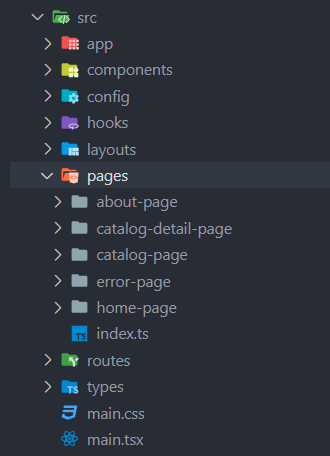
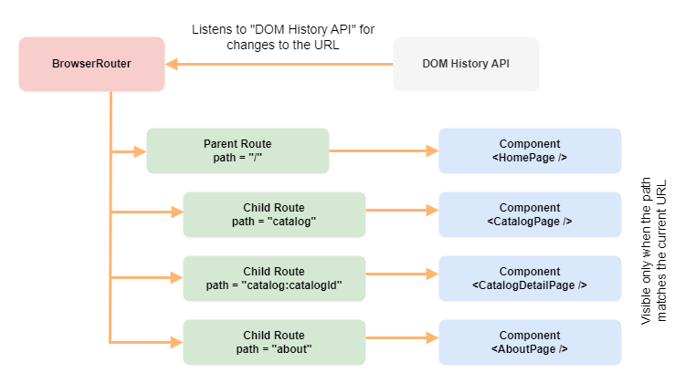

# Маршрутизация в SPA - React Routing

📚 Содержание

- [Что такое routing в SPA (Single Page Application)](#что-такое-routing-в-spa-single-page-application)
- [Обзор библиотеки React Router](#обзор-библиотеки-react-router)
- [Пример использования React Router](#пример-использования-react-router)
  - [Шаг первый: Создайте страницы приложения.](#шаг-первый-создайте-страницы-приложения)
  - [Шаг второй: Создайте глобальный макет с навигацией (Root layout component).](#шаг-второй-создайте-глобальный-макет-с-навигацией-root-layout-component)
  - [Шаг третий: Определите маршруты для страниц.](#шаг-третий-определите-маршруты-для-страниц)
  - [Шаг четвертый: Добавьте маршрутизатор `Router` в приложение.](#шаг-четвертый-добавьте-маршрутизатор-router-в-приложение)

## Что такое routing в SPA (Single Page Application)

**Single Page Application (SPA)** - это тип веб-приложения, который обычно загружает только одну страницу HTML, а затем
динамически обновляет ее содержимое без перезагрузки страницы. Это достигается с помощью использования Javascript для
манипулирования элементами на странице и асинхронной передачи данных с сервера, что дает пользователям более быстрый и
плавный опыт использования веб-приложения, поскольку пользователям не нужно постоянно перезагружать всю страницу целиком
для просмотра новой информации.

**Routing в SPA** - это механизм, который позволяет обрабатывать запросы пользователя веб-приложения для того, что бы
пользователь мог переходить между различными "страницами" внутри приложения, не перезагружая страницу.

Роутинг может быть реализован с помощью библиотеки или фреймворка,
например [React Router](https://reactrouter.com/en/main) или [Reach Router](https://reach.tech/router/), они дают
возможность устанавливать соответствия между URL-адресами и компонентами приложения, которые должны быть отображены для
каждого URL.

Это позволяет повысить удобство использования приложения, уменьшить время загрузки и улучшить производительность.

[⬆ Back to Top](#маршрутизация-в-spa---react-routing)

## Обзор библиотеки React Router

**React Router** является одной из наиболее популярных библиотек маршрутизации для React. React Router предоставляет
компоненты для создания маршрутов и связывания их с компонентами страниц. Также React Router позволяет использовать
параметры маршрута и следить за изменениями истории браузера, что делает ее инструментом мощным и гибким.

⚠️ Библиотека React Router активно разрабатывается и обновляется, актуальную информацию об React Router API смотрите в
документации на официальном сайте [React Router](https://reactrouter.com/en/main).

**Обзор возможностей React Router:**

- Маршрутизация на стороне клиента - позволяет вашему приложению обновлять URL-адрес при переходе по ссылке без
  повторного запроса другого документа с сервера. Вместо этого ваше приложение может немедленно отобразить новый
  пользовательский интерфейс и выполнить запросы данных с помощью fetch, чтобы обновить страницу новой информацией.
- Вложенная маршрутизация - это общая идея связывания сегментов URL-адреса с иерархией компонентов и данными. Вложенные
  маршруты React Router были вдохновлены системой маршрутизации `Ember.js` примерно в 2014 году.
- Динамические сегменты - сегменты URL-адреса могут представлять собой динамические заполнители, которые анализируются и
  передаются различным API.
- Ранжированное сопоставление маршрутов. При сопоставлении URL-адресов с маршрутами React Router ранжирует маршруты по
  количеству сегментов, статических сегментов, динамических сегментов, знаков и т. д. и выбирает наиболее точное
  соответствие.
- Большинство веб-приложений имеют постоянные разделы навигации в верхней части пользовательского интерфейса, на боковой
  панели и часто на нескольких уровнях. Стилизация активных элементов навигации, чтобы пользователь знал, где они
  находятся (`isActive`) или куда они идут (`isPending`) в приложении, легко выполняется с помощью `<NavLink>`.
- Как и HTML `<a href>` - `<Link to>` и `<NavLink to>` могут использовать относительные пути с улучшенным поведением при
  использовании вложенных маршрутов.
- Загрузка данных - поскольку сегменты URL-адресов обычно сопоставляются с постоянными данными вашего приложения, React
  Router предоставляет обычные перехватчики загрузки данных, чтобы инициировать загрузку данных во время навигации. В
  сочетании с вложенными маршрутами, все данные для нескольких макетов по определенному URL-адресу могут загружаться
  параллельно.
- Перенаправления - при загрузке или изменении данных пользователь обычно перенаправляется на другой маршрут.
- Fetchers позволяют вам взаимодействовать с actions и loaders маршрутов, не вызывая навигацию в браузере, но при
  этом получая все обычные преимущества, такие как обработка ошибок, повторная проверка, обработка прерываний и
  обработка `Race condition`.

Библиотека React Router состоит из хуков, функций и компонентов.

Это основные компоненты React Router 6, которые чаще всего используются в React-приложениях:

- `<BrowserRouter>` - этот компонент использует `HTML5 History API` (`pushState`, `replaceState` и
  событие `popstate`) для управления URL-адресами и отображения соответствующих компонентов при изменении URL-адреса.
  Этот компонент рендерит URL-адрес без символа `#`, например, `/about`, что делает URL-адрес более читаемым и лучше
  оптимизированным для поисковых систем.
- `<HashRouter>` точно так же как и `<BrowserRouter>` использует `HTML5 History API`, в свою очередь, использует
  хэш-фрагменты URL-адресов для управления маршрутизацией и отображения компонентов при изменении URL-адреса. Это
  означает, что компонент рендерит URL-адрес со значением хэш-фрагмента, например, `/#/about`. Использование хеша в
  URL-адресе имеет несколько преимуществ, так как он позволяет обеспечить поддержку браузеров, которые не поддерживают
  `HTML5 History API`, а также позволяет легко развернуть приложение на статических хостингах.
- `<Router>` - это низкоуровневый интерфейс, который используется всеми компонентами маршрутизатора (
  например `<BrowserRouter>` или `<HashRouter>`). С точки зрения React, `<Router>` - это поставщик контекста, который
  предоставляет информацию о маршрутизации остальной части приложения.
- `<RouterProvider>` - это компонент предоставляет контекст для общего доступа к объекту `Router`, который является
  ядром маршрутизации и используется для рендеринга компонентов `<Route>` и других компонентов, связанных с
  маршрутизацией.
- `<Link>` - это компонент, который позволяет создать ссылки, для перенаправления пользователя на другие страницы
  приложения.
- `<NavLink>` — это особый вид `<Link>`, который знает, является ли он «активным» или «ожидающим». Это полезно при
  создании меню навигации, например навигационной цепочки или набора вкладок, где вы хотите показать, какая из них
  выбрана в данный момент. Он также предоставляет полезный контекст для вспомогательных технологий, таких как программы
  чтения с экрана.
- `<Outlet>` - это компонент, который используется в родительских элементах маршрута для визуализации дочерних элементов
  маршрута. Если родительский маршрут точно совпал, он отобразит дочерний индексный маршрут или ничего, если индексный
  маршрут отсутствует.

React Router 6 также предоставляет множество хуков (hooks), которые облегчают работу с маршрутизацией внутри
компонентов:

- `useRoutes()` - этот хук является функциональным эквивалентом компонента `<Routes>`, но для определения маршрутов он
  использует объекты JavaScript вместо элементов `<Route>`. Эти объекты имеют те же свойства, что и обычные
  элементы `<Route>`, но для них не требуется JSX.
- `useNavigate()`- это хук, который используется для навигации по маршрутам в приложении. Он позволяет осуществлять
  переходы между страницами без изменения их URL-адресов.
- `useLocation()` - это хук, который используется для получения текущего адреса URL. Этот хук может быть полезен для
  отображения текущей страницы в интерфейсе и отслеживания истории навигации.
- `useParams()` - это хук, который используется для получения параметров маршрута. Параметры маршрута могут быть
  использованы
  для передачи дополнительной информации между страницами.
- `useMatch()` - это хук, который используется для получения информации о сопоставлении текущего URL-адреса с
  маршрутом. Этот
  хук может быть использован для настройки отображения интерфейса в зависимости от сопоставленного маршрута.
- `useOutlet()` - этот хук, который используется для отображения вложенных маршрутов. Он позволяет вкладывать дочерние
  компоненты в основной маршрут и отображать их при сопоставлении URL-адресов. Этот хук используется внутри
  компонента `<Outlet>` для рендеринга вложенных маршрутов.

## Пример использования React Router

Для создания приложения, демонстрирующего возможности React Router 6 (сокращенно **RR6**) выполните следующие шаги:

- [Шаг первый: Создайте страницы приложения.](#шаг-первый-создайте-страницы-приложения)
- [Шаг второй: Создайте глобальный макет с навигацией (Root layout component).](#шаг-второй-создайте-глобальный-макет-с-навигацией-root-layout-component)
- [Шаг третий: Определите маршруты для страниц.](#шаг-третий-определите-маршруты-для-страниц)
- [Шаг четвертый: Добавьте маршрутизатор `Router` в приложение.](#шаг-четвертый-добавьте-маршрутизатор-router-в-приложение)

### Шаг первый: Создайте страницы приложения

Наше приложение будет состоять из четырех основных страниц (компонентов) и страницы 404:

- `<HomePage />`
- `<CatalogPage />`
- `<CatalogDetailPage />`
- `<AboutPage />`
- `<ErrorPage />`



❗ Данная структура директорий не связана с определенной методологией или архитектурой, она реализует "классическую"
архитектуру приложений React (Group by file types).

`<HomePage />`, `<AboutPage />` и  `<ErrorPage />` это простые компоненты которые будут рендерить статический контент,
то есть простой текст (здесь и далее все примеры будут представлены на JavaScript):

```jsx
// src/pages/home-page/home-page.jsx
import { ReactElement } from 'react';

export const HomePage = () => {
  return (
    <>
      <PageHeader>What is a Home Page?</PageHeader>
      <p>
        A homepage is a page designated...
      </p>
    </>
  );
}
```

```jsx
// src/pages/about-page/about-page.jsx
import { ReactElement } from 'react';

export const AboutPage = () => {
  return (
    <>
      <h1>What Is an About Us Page?</h1>
      <p>
        The About Us page of...
      </p>
    </>
  );
};
```

```jsx
// src/pages/error-page/error-page.jsx
import { ReactElement } from 'react';

export const ErrorPage = () => {
  return <h1>404 Not found!</h1>;
};

```

`<CatalogPage />` - это страница отображает список публикаций при помощи дочерних компонентов `<PostsList />`
и`<Pagination />` используя для запроса хук `useFetch()`

- `<CatalogPage />`
  - `<PostsList />`
    - `<PostRow />`
  - `<Pagination />`

```jsx
// src/pages/catalog-page/catalog-page.jsx
import { useEffect, useState } from 'react';
import { useSearchParams } from 'react-router-dom';

import { useFetch } from '@/hooks';
//...

export const CatalogPage = () => {
  const [searchParams, setSearchParams] = useSearchParams();

  const [uri, setUri] = useState(`${API_URI}?_limit=6&_page=1`);

  const {data, error} = useFetch(uri);

  // Computed variable
  const page = parseInt(searchParams.get('page') || '1', 10);

  const handleChangePage = (nextPage) => setSearchParams(`page=${nextPage}`);

  useEffect(() => {
    const currentPage = parseInt(searchParams.get('page') || '1', 10);

    setUri(`${API_URI}?_limit=6&_page=${currentPage}`);
  }, [searchParams]);

  //...

  return (
    <>
      <PostsList posts={data} />
      <Pagination
        prev={page === 1}
        next={page === MAX_PAGE_COUNT}
        onPrev={() => handleChangePage(page - 1)}
        onNext={() => handleChangePage(page + 1)}
      />
    </>
  );
};
```

Компонент `<CatalogPage />` содержит одну переменную состояния `uri` которая передаются в вызов хука `useFetch(uri)` для
получения данных с внешнего `fake REST API` JSON сервера, выполнение запроса к которому возвращает массив публикаций в
формате JSON.

Хук `setSearchParams()` используется для чтения и изменения строки запроса в URL-адресе, он возвращает массив
аналогично `React.useState()` из двух значений: объект
типа [URLSearchParams](https://developer.mozilla.org/en-US/docs/Web/API/URLSearchParams) и функцию для изменения
этого объекта.

Хук `useEffect()` следит за переменной `searchParams`, как только значение переменной меняется, `useEffect()` обновляет
состояние компонента, тем самым вызывая запрос на получение новых данных через хук `useFetch()`.

🚩 Данная реализация является упрощенной, `useEffect()` не должен напрямую менять состояние компонента, вместо этого он
должен вызывать метод или функцию которая не является частью логики, влияющей на рендеринг компонента
(_рендеринг компонентов и логика эффектов должны быть независимы_) - например это может
быть [вызов асинхронного метода](https://redux-toolkit.js.org/usage/usage-guide#redux-data-fetching-patterns) для
обновления
глобального состояния, реализованного через [Redux Toolkit](https://redux-toolkit.js.org).

Компонент `<Pagination />` использует обработчик событий родительского компонента `handleChangePage()`, через который
меняет значение переменной `searchParams`, вызывая таким образом срабатывание эффекта для запуска запроса
через `useFetch()` и изменения строки запроса в URL-адресе.

`<CatalogDetailPage />` - это страница отображает одну публикацию при помощи дочернего компонента `<PostDetail />`

```jsx
// src/pages/catalog-detail-page/catalog-detail-page.jsx
import { useParams } from 'react-router-dom';

export const CatalogDetailPage = () => {
  const {catalogId} = useParams();

  const {data, error} = useFetch(`${API_URI}/${catalogId}`);

  //...

  return (
    <>
      <div className={styles.detail}>
        <PostDetail data={data} />
      </div>
    </>
  );
};
```

Ключевой особенностью данного компонента является получение параметра `catalogId` из URL-адреса через хук `useParams()`,
на основании которого выполняется запрос для получения данных.

[⬆ Back to Top](#маршрутизация-в-spa---react-routing)

### Шаг второй: Создайте глобальный макет с навигацией (Root layout component).

Теперь давайте создадим root элемент `<RootLayout/ >`, внутри которого благодаря компоненту `<Outlet>`, будут
рендериться дочерние компоненты вашего приложения, пример такого компонента (_примерная реализация_):

```jsx
// src/layouts/root-layout.jsx
import { ReactElement } from 'react';
import { Outlet } from 'react-router-dom';

export const RootLayout = () => {
  return (
    <>
      <header>Some header here</header>
      <main>
        <Outlet />
      </main>
      <footer>Some fooer here</footer>
    </>
  );
};
```

Каждый раз, когда URL-адрес будет меняться, маршрутизатор будет инициировать рендеринг соответствующего компонента,
который будет отображен на месте `<Outlet>`.

💡 В **RR6** не реализованы алиасы или именованные маршруты, поэтому эта задача ложится на плечи программиста.

Предпочтительный вариант в таком случае, это создать константу с описанием всех маршрутов, которые будут использоваться
вашим приложением, например:

```js
// src/config/index.js
export const APP_ROUTES = {
  HOME: '/',
  CATALOG: 'catalog',
  ABOUT: 'about',
};
```

Это позволит использовать алиас маршрута, и в случае чего изменить маршрут, не исправляя его во всех связанных с ним
компонентах.

Секция `header` должна содержать меню навигации по страницам приложения, пример реализации такого компонента:

```jsx
// src/components/top-menu/top-menu.jsx
import { NavLink } from 'react-router-dom';

import { APP_ROUTES } from '@/config';

export const TopMenu = () => {
  //...

  return (
    <nav>
      <NavLink to={APP_ROUTES.HOME} className={computedClassName}>
        Home
      </NavLink>
      <NavLink to={APP_ROUTES.CATALOG} className={computedClassName}>
        Catalog
      </NavLink>
      <NavLink to={APP_ROUTES.ABOUT} className={computedClassName}>
        About
      </NavLink>
    </nav>
  );
};
```

Компонент `<NavLink>` рендерит ссылку в виде тега `<a href="..." class="...">`, и может принимать функцию обратного
вызова для пропса `className` с дополнительными аргументами, на основе которых можно определить является ли ссылка в
данным момент активной.

[⬆ Back to Top](#маршрутизация-в-spa---react-routing)

### Шаг третий: Определите маршруты для страниц.

Для того что бы маршрутизация заработала, необходимо создать компонент `<Router>`, который будет управлять
маршрутизацией и хранить текущий маршрут. Этот компонент оболочка (Higher-Order Component, HOC), оборачивающий всё
приложение, которое должно использовать маршрутизацию.

Библиотека **React Router (RR6)** (_версия 6.16.0 на момент написания материала_) предлагает два варианта для создания
маршрутов (в обозримом будущем возможно больше или меньше):

- Через добавление различных маршрутов (routes) с помощью компонента `<Routes>`;
- Путем создания объекта `Router` через вызов функций `createBrowserRouter` или `createHashRouter`;

И соответственно, обеспечить доступ компонентам приложения к маршрутизатору можно через использование
компонента `<BrowserRouter>` (так же как и `<HashRouter>`) или через компонент `<RouterProvider>`, который принимает в
качестве аргумента объект `Router`.

Вы можете использовать модель вложенных маршрутов с определением root элемента (макета в виде
компонента `<RootLayout />`) и рендеренгом дочерних компонентов на основе компонента `<Outlet>`, тогда маршруты вашего
приложения могут выглядеть следующим образом:



Каждый маршрут (`<Route>`) обязательно должен имеет свойство `path`, которое определяет шаблон URL-адреса для
сопоставления. Еще одно свойство `element` будет укрывать какой именно компонент должен быть визуализирован (отрендерен)
на основании выбранного маршрута.

Маршруты могут иметь динамические параметры, которые указываются в пути URL-адреса с использованием названия параметра
через двоеточие. Например, `<Route path="catalog/:catalogId">` описывает маршрут, который будет соответствовать
URL `catalog/123`, где `123` - это значение параметра `catalogId`.

Теперь вы можете создать объект `Router` с необходимыми маршрутами:

```jsx
// src/routes/index.jsx
import { createBrowserRouter } from 'react-router-dom';

import { APP_ROUTES } from '@/config';
import { RootLayout } from '@/layouts';
import { AboutPage, CatalogDetailPage, CatalogPage, ErrorPage, HomePage } from '@/pages';

export const router = createBrowserRouter([
  {
    path: APP_ROUTES.HOME,
    element: <RootLayout />,
    errorElement: <ErrorPage />,
    children: [
      {path: APP_ROUTES.HOME, element: <HomePage />},
      {path: APP_ROUTES.CATALOG, element: <CatalogPage />},
      {path: `${APP_ROUTES.CATALOG}/:catalogId`, element: <CatalogDetailPage />},
      {path: APP_ROUTES.ABOUT, element: <AboutPage />},
    ],
  },
]);
```

Объект `router` будет состоять из одного маршрута верхнего уровня `{path: "/", element: <RootLayout />}`, который будет
содержать список дочерних маршрутов `children`, которые будут рендериться через `<Outlet>` в компоненте `<RootLayout />`

Дополнительное свойство `errorElement` содержит компонент который будет рендериться в случае если запрошенный маршрут не
будет найден в списке дочерних маршрутов - это один из вариантов реализации страницы `404 Not Found`.

[⬆ Back to Top](#маршрутизация-в-spa---react-routing)

### Шаг четвертый: Добавьте маршрутизатор `Router` в приложение.

На этом шаге нужно добавить все данные маршрутизатора `Router` в ваше приложение. Это делается через
компонент `<RouterProvider>`, который "под капотом" использует реализацию `React.useContext()`;

```jsx
// src/app/app.jsx
import { RouterProvider } from 'react-router-dom';

import { router } from '@/routes';

const App = () => {
  return <RouterProvider router={router} />;
};
```

На этом создание приложения с использованием **React Router 6** будет завершено.

### Итог

- **RR6** позволяет осуществлять навигацию без перезагрузки страницы, что улучшает пользовательский опыт в вашем
  приложении.
- **RR6** предоставляет удобный API для определения маршрутов и их параметров. Это позволяет упростить работу с
  навигацией и обработкой URL-адресов в приложении.
- **RR6** позволяет динамически создавать маршруты на основе параметров в URL-адресах.
- **RR6** использует функциональные компоненты и хуки, поддерживает ленивую загрузку компонентов, что позволяет
  уменьшить время загрузки страницы.
- **RR6** дает возможность создавать любые маршруты и иерархии маршрутов в приложении. Это позволяет
  создавать разнообразные приложения с различными требованиями по навигации.
- **RR6** поддерживает серверный рендеринг и может быть использован в приложениях, которые выполняют рендеринг на
  стороне сервера.

[⬆ Back to Top](#маршрутизация-в-spa---react-routing)

🔗 [Ссылка на деплой приложения с React Router 6](https://react-router-ab1e50.netlify.app)

Готовый пример с приложением находится в `src` раздела chapter-14.

Для запуска примера с готовым приложением выполните команды:

```shell
git clone https://github.com/shopot/react-101.git

git checkout chapter-14

npm install

npm run dev
```

Документация по теме:

- 🔗 [React Route](https://reactrouter.com/en/main)

[⬆ Back to Top](#маршрутизация-в-spa---react-routing)
