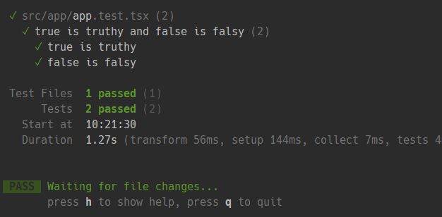

# Обзор React Testing Library

📚 Содержание

[@testing-library](https://testing-library.com/docs/) - это библиотека для тестирования пользовательского интерфейса (
UI)
веб-приложений на JavaScript.

`@testing-library` не привязана к конкретному фреймворку и может использоваться с любыми фреймворками для разработки
веб-приложений на JavaScript, такими как React, Angular, Vue, Svelte и др. Она предоставляет инструменты для поиска
элементов страницы и взаимодействия с ними, а также утверждения (assertions) для проверки, что приложение работает
правильно.

`@testing-library` имеет отдельные библиотеки для каждого фреймворка, которые предоставляют специальные утилиты и
функции
для работы с этим фреймворком. Например:

- `@testing-library/react` для React;
- `@testing-library/angular` для Angular;
- `@testing-library/vue` для Vue.

### Чем не является эта библиотека

- Инструментом запуска тестов (Vitest или Jest) или фреймворком;
- Специфичной библиотекой для конкретного тестового фреймворка;

DOM Testing Library работает с любой средой выполнения, предоставляющей API-интерфейсы DOM,
например [Jest](https://jestjs.io/), [Mocha](https://mochajs.org/) + [JSDOM](https://github.com/jsdom/jsdom)
или реальным браузером.

### Чего следует избегать при использовании Testing Library

Testing Library рекомендует избегать тестирования деталей реализации, таких как внутреннее устройство тестируемого
компонента (хотя это все еще возможно). Руководящие принципы этой библиотеки подчеркивают упор на тесты, которые очень
похожи на то, как пользователи взаимодействуют с вашими веб-страницами.

Возможно, вам захочется избежать следующих деталей реализации при тестировании компонента:

- Внутреннее состояние компонента
- Внутренние методы компонента
- Методы жизненного цикла компонента
- Дочерние компоненты

## Queries - запросы

Запросы (Queries) - это методы, которые библиотека тестирования предоставляет вам для поиска элементов на странице.

Существует три вида запросов:

- **get** - это метод запроса для поиска элемента, который возвращает соответствующий узел для запроса.
- **query** - это метод запроса для поиска элемента, который возвращает значение `null`, если ни один элемент не
  соответствует. Этот запрос полезен для проверки отсутствия элемента.
- **find** - это метод запроса возвращает Promise, который разрешается, когда найден элемент, соответствующий
  данному запросу.

Пример запроса **get**:

```jsx
import { render, screen } from '@testing-library/react' // (or /dom, /vue, ...)

test('should show login form', () => {
  render(<Login />)
  const input = screen.getByLabelText('Username')
  // Events and assertions...
})
```

### Типы запросов

#### Для одного элемента

- `getBy...` - возвращает соответствующий узел для запроса, выдает информативную ошибку, если ни один элемент не
  соответствует или найдено более одного совпадения (вместо этого используйте `getAllBy...`, если ожидается более одного
  элемента).
- `queryBy...` - возвращает соответствующий узел для запроса, возвращает значение `null`, если ни один элемент не
  соответствует. Это полезно для проверки отсутствия элемента. Выдает ошибку, если найдено более одного совпадения (
  вместо этого используйте `queryAllBy...`, если это нормально).
- `findBy...`: возвращает Promise, который разрешается, когда найден элемент, соответствующий данному запросу. Promise
  отклоняется, если ни один элемент не найден или обнаружено более одного элемента после тайм-аута по умолчанию,
  равного 1000 мс. Если вам нужно найти более одного элемента, используйте `findAllBy...`.

| Type of Query | 	0 Matches	 | 1 Match        | >1 Matches  | Retry (Async/Await) |
|---------------|-------------|----------------|-------------|---------------------|
| `getBy...`    | Throw error | Return element | Throw error | No                  |
| `queryBy...`  | Return null | Return element | Throw error | No                  |
| `findBy...`   | Throw error | Return element | Throw error | Yes                 |

#### Для нескольких элементов

- `getAllBy...` - возвращает массив всех совпадающих узлов для запроса или выдает ошибку, если ни один из элементов не
  соответствует.
- `queryAllBy...` - возвращает массив всех совпадающих узлов для запроса или возвращает пустой массив ([]), если ни один
  элемент не соответствует.
- `findAllBy...` - возвращает Promise, который преобразуется в массив элементов если найдены какие-либо элементы,
  соответствующие заданному запросу. Promise отклоняется, если после тайм-аута по умолчанию, равного 1000 мс, элементы
  не
  найдены.

Методы `findBy...` представляют собой комбинацию запросов `getBy...`
и [waitFor](https://testing-library.com/docs/dom-testing-library/api-async#waitfor). Они принимают параметры `waitFor`
в качестве последнего аргумента (т.е. `await screen.findByText('text', queryOptions, waitForOptions)`)

| Type of Query   | 	0 Matches	 | 1 Match      | >1 Matches   | Retry (Async/Await) |
|-----------------|-------------|--------------|--------------|---------------------| 
| `getAllBy...`   | Throw error | Return array | Return array | No                  |
| `queryAllBy...` | Return []   | Return array | Return array | No                  |
| `findAllBy...`  | Throw error | Return array | Return array | Yes                 |

### Приоритет

Согласно Руководящим принципам, ваш тест должен максимально напоминать то, как пользователи взаимодействуют с вашим
кодом (компонентом, страницей и т. д.). Учитывая это, рекомендованный порядок приоритетов будет следующим:

#### 1. **Queries Accessible to Everyone**

1. **getByRole** - его можно использовать для запроса каждого элемента, представленного
   в [дереве доступности](https://www.w3.org/TR/accname-1.1/). Это должно быть вашим главным предпочтением практически
   во всем. Чаще всего это будет использоваться с опцией `name`, например:
   ```js
    getByRole('button', { name: /submit/i });
    ```
2. **getByLabelText** - этот метод действительно хорош для полей формы. При навигации по форме веб-сайта пользователи
   находят элементы с помощью [label text](https://testing-library.com/docs/queries/bylabeltext). Этот метод имитирует
   это поведение, поэтому он должен быть вашим главным предпочтением при работе с формами.
3. **getByPlaceholderText** - placeholder не заменяет метку. Но если это все, что у вас есть, то это лучше чем
   альтернативы.
4. **getByText** - вне форм текстовое содержимое является основным способом поиска элементов. Этот метод можно
   использовать для поиска не интерактивных элементов (таких как элементы `div`, `span` и `p`).
5. **getByDisplayValue** - текущее значение элемента формы может быть полезно при навигации по странице с заполненными
   значениями.

#### 2. Semantic Queries

1. **getByAltText** - если ваш элемент поддерживает `alt` текст (изображение, область, ввод и любой пользовательский
   элемент), вы можете использовать его для поиска этого элемента.

2. **getByTitle** - атрибут `title` не всегда читается программами чтения с экрана и по умолчанию не отображается для
   зрячих пользователей.

#### 3. Test IDs

1. **getByTestId** - пользователь не может видеть (или слышать) их, поэтому это рекомендуется только в тех случаях,
   когда вы не можете сопоставить их по роли или тексту или это не имеет смысла (например, если текст динамический).

## Vitest с React Testing Library

Новички в React часто путают инструменты для тестирования в React. Библиотека `@testing-library/react` не является
альтернативой Vitest, поскольку они нужны друг другу и у каждого из них есть четкая задача.

Помимо запуска тестов, который вы можете запустить с помощью `npm run test` после соответствующей
настройки `package.json`
с помощью тестового сценария, Vitest предлагает вам следующие функции для ваших тестов:

- `describe()` - определение набора тестов, наборы могут быть вложенными;
- `test()` или `it()` - определение теста внутри любого набора тестов, `it()` это псевдоним для функции `test()`;
- `expect()` - определяет ожидания, которые проверяются в тесте;

Функция `describe()` объединяет в себе группу взаимосвязанных тестов. Первым параметром она принимает текстовое описание
группы, вторым - функцию, которая содержит конфигурацию и набор тестов.

```jsx
// app.test.jsx
describe('my function or component', () => {
  // ...
});
```

В `describe()` сам тест описывается функцией `it()`. Она также принимает в качестве параметров текстовое описание и
функцию, в которой описана вся логика теста.

```jsx
// app.test.jsx
describe('my function or component', () => {
  it('does the following', () => {
    // ...
  });
});
```

Проверка результата выполнения осуществляется с помощью функции `expect()`, принимающей итоговое значение, в связке с
одной из функций соответствия.

```jsx
// app.test.jsx
describe('true is truthy and false is falsy', () => {
  it('true is truthy', () => {
    expect(true).toBe(true);
  });

  it('false is falsy', () => {
    expect(false).toBe(false);
  });
});
```

После того как вы запустите свои тесты с помощью `npm run test` (или любого другого сценария, который вы используете в
своем package.json), вы увидите следующий вывод для двух ранее определенных тестов:



После прохождения всех тестов, которые должны стать зелеными, Vitest предлагает вам интерактивный интерфейс, в котором
вы можете дать ему дальнейшие инструкции. Если вы меняете файл, будь то исходный код или файл теста, Vitest снова
запускает все ваши тесты.

## React Testing Library - Рендеринг компонента

Для рендеринга React компонентов, библиотека `@testing-library/react` (далее просто RTL) предоставляет
функцию `render()`. Для примера давайте рассмотрим следующий функциональный компонент, называемый компонентом
приложения:

```jsx
// app.jsx
const title = 'Hello React';

export const App = () => {
  return <h1>{title}</h1>;
}
```

И тест из файла соответствующего `app.test.jsx`:

```jsx
import { render } from '@testing-library/react';

import { App } from './app';

describe('App', () => {
  it('renders App component', () => {
    render(<App />);
  });
});
```

Здесь функция `render()` принимает любой JSX в качестве аргумента для отображения его в качестве вывода, возвращает
объект с "контейнером" (как если бы вы наткнулись на элемент div в реальной жизни), который сгенерирован для вашего
компонента. Этот контейнер содержит весь HTML, который был создан при рендеринге вашего компонента в виртуальном DOM.

Ниже представлен неполный список свойств возвращаемого объекта (полный список см.
на [render Result](https://testing-library.com/docs/react-testing-library/api#render-result)):

- **...queries** - это запросы (Queries) из [DOM Testing Library](#queries---запросы), которые автоматически
  возвращаются с первым аргументом, привязанным к `baseElement`, который по умолчанию имеет значение `document.body`.

  ```jsx
  const {getByRole, getByLabelText} = render(<App />);
  ```
- **container** - содержащий узел DOM вашего элемента React (отрендеренного с использованием `ReactDOM.render()`), как
  правило `<div>` если не задано ничего другого. Так как это обычный узел DOM, то вы можете
  вызвать `Container.querySelector` и т. д. для проверки дочерних элементов.
- **baseElement** - содержащий узел DOM, в контейнере которого рендерится ваш компонент React, по умолчанию
  это `document.body`.
- **debug** - это метод является сокращением для `console.log(prettyDOM(baseElement))`;

Следующий фрагмент кода иллюстрирует использование метода `debug()`:

```jsx
import { render, screen } from '@testing-library/react';

import { App } from './app';

describe('App', () => {
  it('renders App component', () => {
    render(<App />);

    screen.debug();
  });
});
```

После запуска теста в командной строке вы должны увидеть вывод HTML вашего компонента приложения:

```jsx
<body>
<div>
  <h1>
    Hello React
  </h1>
</div>
</body>
```

> Вы можете использовать метод `debug()` каждый раз когда вам требуется отладка при написании теста.

Здесь библиотека RTL не особо заботится о реальных компонентах. Библиотека RTL используется для взаимодействия с вашими
компонентами React, точно так же как реальный пользователь. То, что видит пользователь - это просто отрендеренный
HTML-код из ваших React компонентов, именно его вы и получаете в качестве результата рендеринга с использованием RTL.

## React Testing Library - выбор элементов

Библиотека RTL также экспортирует объект-обертку **screen**, каждый запрос которого предварительно привязан к
`document.body` (с использованием внутренней функциональности).

Вы можете использовать объект **screen** для доступа к методам запроса (Queries), таким как `getByText()` и т.д., для
поиска узлов DOM - это является наиболее предпочтительным способом работы с запросами.

```jsx
import { render } from '@testing-library/react';

import { App } from './app';

describe('App', () => {
  it('renders App component', () => {
    const {getByRole} = render(<App />);

    expect(getByRole('heading', {level: 1})).toBeInTheDocument();
  });
});
```

Этот фрагмент кода является эквивалентом для:

```jsx
import { render, screen } from '@testing-library/react';

import { App } from './app';

describe('App', () => {
  it('renders App component', () => {
    render(<App />);

    expect(screen.getByRole('heading', {level: 1})).toBeInTheDocument();
  });
});
```

Использование **screen** является наиболее предпочтительным способом работы с запросами.

По умолчанию запросы типа **get** и **find** выдают ошибку, если элемент не может быть найден. Это полезно для подсказки
при написании теста о том, что выбранного элемента вообще нет. Некоторые используют это поведение в качестве неявной
замены утверждения вместо явного утверждения с ожиданием (expect()):

```jsx
import { render, screen } from '@testing-library/react';

import { App } from './app';

describe('App', () => {
  it('renders App component', () => {
    render(<App />);

    // implicit assertion
    // because getByText would throw error
    // if element wouldn't be there
    screen.getByText('Hello React');

    // explicit assertion
    // recommended
    expect(screen.getByText('Hello React')).toBeInTheDocument();
  });
});
```

Функция-запрос `getByText()` может принимать в качестве аргумента строку, а также регулярное выражение.
В то время как для точного совпадения используется строковый аргумент, для частичного совпадения можно использовать
регулярное выражение, что зачастую более удобно:

```jsx
import { render, screen } from '@testing-library/react';

import { App } from './app';

describe('App', () => {
  it('renders App component', () => {
    render(<App />);

    // Fails
    expect(screen.getByText('Hello')).toBeInTheDocument();

    // Succeeds
    expect(screen.getByText('Hello React')).toBeInTheDocument();

    // Succeeds
    expect(screen.getByText(/Hello/)).toBeInTheDocument();
  });
});
```

Функция-запрос `getByText()` - это лишь одна из многих запросов поиска в библиотеке RTL.

Хотя текст часто является распространенным способом выбора элементов с помощью RTL, так же существует поиск
элемента по заданной роли **ByRole**, это такие методы как `getByRole`, `queryByRole`, `getAllByRole`, `queryAllByRole`,
`findByRole`, `findAllByRole`.

`getByRole()` обычно используется для получения элементов по атрибутам `aria-label`. Однако также
есть [неявные роли для элементов HTML](https://developer.mozilla.org/en-US/docs/Web/Accessibility/ARIA/Roles) -
например `button` для элемента `button`. Таким образом, вы можете выбирать элементы не только по
видимому тексту, но и по их роли доступности с помощью RTL.

Интересная особенность `getByRole()` - он показывает все доступные для выбора роли, если вы предоставляете роль, которая
недоступна в HTML отрендеренного компонента:

```jsx
import { render, screen } from '@testing-library/react';

import { App } from './app';

describe('App', () => {
  it('renders App component', () => {
    render(<App />);

    screen.getByRole('')
  });
});
```

Это означает, что предыдущий тест после запуска выводит в командную строку следующее:

```
TestingLibraryElementError: Unable to find an accessible element with the role ""

Here are the accessible roles:

  heading:

  Name "Hello React":
  <h1 />

  --------------------------------------------------
 
Ignored nodes: comments, script, style
<body>
  <div>
    <h1>
      Hello React
    </h1>
  </div>
</body>

```

Еще один вариант посмотреть все доступные для выбора роли это использовать
функцию [logRoles()](https://testing-library.com/docs/dom-testing-library/api-accessibility#logroles):

```jsx
// ...
describe('App', () => {
  it('renders App component', () => {
    const {container} = render(<App />);

    logRoles(container);
  });
});
```

Следующий фрагмент кода демонстрирует как с помощью неявной роли HTML-элемента получить этот самый элемент:

```jsx
import { render, screen } from '@testing-library/react';

import { App } from './app';

describe('App', () => {
  it('renders App component', () => {
    render(<App />);

    // By a specific heading level
    expect(screen.getByRole('heading', {level: 1})).toBeInTheDocument();
  });
});
```

Поэтому довольно часто нет необходимости явно назначать роли через `aria` элементам HTML ради тестирования,
поскольку в DOM уже есть неявные роли, прикрепленные к HTML-элементам.

Существуют и другие типы запросов, более специфичные для элементов:

- **LabelText**: getByLabelText(): `<label for="search" />`
- **PlaceholderText**: getByPlaceholderText(): `<input placeholder="Search" />`
- **AltText**: getByAltText(): ``
- **DisplayValue**: getByDisplayValue(): `<input value="JavaScript" />`

## Поиск на основе запросов queryBy и findBy

Запросы **queryBy** и **findBy** могут быть расширены с помощью тех же типов поиска, которые есть в **getBy**:

- `queryByText`
- `queryByRole`
- `queryByLabelText`
- `queryByPlaceholderText`
- `queryByAltText`
- `queryByDisplayValue`

то же самое для **findBy**

- `findByText`
- `findByRole`
- `findByLabelText`
- `findByPlaceholderText`
- `findByAltText`
- `findByDisplayValue`

### В чем разница между getBy и queryBy?

Как вы уже знаете **getBy** возвращает элемент или ошибку. Удобный побочный эффект getBy заключается в том, что он
возвращает ошибку, поскольку он позволяет, заранее заметить, что в нашем тесте что-то не так. Однако это затрудняет
проверку элементов, которых там не должно быть.

```jsx
import { render, screen } from '@testing-library/react';

import { App } from './app';

describe('App', () => {
  it('renders App component', () => {
    render(<App />);

    // Fails
    expect(screen.getByText(/Searches for JavaScript/)).toBeNull();
  });
});
```

Это не будет работать, хотя элемента с текстом `Searches for JavaScript` не существует, **getBy** выдает ошибку, прежде
чем мы сможем сделать утверждение, поскольку он не может найти элемент с этим текстом.

Чтобы подтвердить элементы отсутствие элемента, можно заменить **getBy** на **queryBy**:

```jsx
import { render, screen } from '@testing-library/react';

import { App } from './app';

describe('App', () => {
  it('renders App component', () => {
    render(<App />);

    // Fails
    expect(screen.queryByText(/Searches for JavaScript/)).toBeNull();
  });
});
```

Поэтому каждый раз, когда требуется утверждение, что элемента нет, нужно использовать **queryBy**. В противном случае по
умолчанию используется **getBy**.

### Когда использовать findBy?

Вариант запроса **findBy** возвращает Promise, который будет разрешен только тогда, когда элемент будет найден или
отклонен во всех других случаях. Это означает, что **findBy** нужно использовать для поиска элемента, который должен
появиться в результате асинхронных действий.

Для подходящего сценария рассмотрим следующую реализацию компонента `<App />`

```jsx
const getUser = () => {
  return Promise.resolve({id: '1', name: 'Robin'});
};

const App = () => {
  const [user, setUser] = useState(null);

  useEffect(() => {
    const loadUser = async () => {
      const user = await getUser();
      setUser(user);
    };

    loadUser();
  }, []);

  return (
    <div>
      {user ? <p>Signed in as {user.name}</p> : null}
    </div>
  );
};
```

После первоначальной отрисовки компонент приложения извлекает пользователя из смоделированного API. Вызов метода API с
`async/await` возвращает объект `User`, который потом сохраняется в переменную состояния компонента. Изменение состояния
вызывает повторный ренедеринг компонента и далее условный рендеринг отображает `Signed in as Robin`.

Если необходимо протестировать компонент на протяжении всего жизненного цикла, от его первого рендеринга до второго
рендеринга, то в этом случае нужно написать асинхронный тест, для того что бы дождаться асинхронного разрешения
Promise. Другими словами, нужно дождаться отображения пользователя после обновления переменной состояния.

```jsx
import { render, screen } from '@testing-library/react';

import { App } from './app';

describe('App', () => {
  it('renders App component', async () => {
    render(<App />);

    expect(screen.queryByText(/Signed in as/)).toBeNull();

    expect(await screen.findByText(/Signed in as/)).toBeInTheDocument();
  });
});
```

Если вы не верите, что это действительно работает, добавьте две функции отладки и проверьте их выходные данные в
командной строке:

```jsx
import { render, screen } from '@testing-library/react';

import { App } from './app';

describe('App', () => {
  it('renders App component', async () => {
    render(<App />);

    expect(screen.queryByText(/Signed in as/)).toBeNull();

    screen.debug();

    expect(await screen.findByText(/Signed in as/)).toBeInTheDocument();

    screen.debug();
  });
});
```

### Функции сопоставления - Assertive functions

Функции сопоставления (Assertive functions) располагаются в правой части утверждения.
В предыдущих тестах вы уже использовали две функции: `toBeNull()` и `toBeInTheDocument()`.
Обе эти функции в основном используются в RTL для проверки наличия или отсутствия элемента.

Обычно функции сопоставления предоставляются самим Vitest, по умолчанию это chai-утверждения, а также
утверждения, совместимые с [Jest](https://jestjs.io/), построенные на
основе [Chai Assertion Library](https://www.chaijs.com/).

Полный список доступных функций предоставляемых Vitest можно найти на странице
описания [expect]([expect()](https://vitest.dev/api/expect.html)).

Однако RTL позволяет расширить этот API своими собственными функциями, такими например как `toBeInTheDocument()`.
Все эти функции входят в пакет [@testing-library/jest-dom](https://github.com/testing-library/jest-dom), который
устанавливается дополнительно вместе с RTL:

- [`toBeDisabled`](https://github.com/testing-library/jest-dom#tobedisabled)
- [`toBeEnabled`](https://github.com/testing-library/jest-dom#tobeenabled)
- [`toBeEmptyDOMElement`](https://github.com/testing-library/jest-dom#tobeemptydomelement)
- [`toBeInTheDocument`](https://github.com/testing-library/jest-dom#tobeinthedocument)
- [`toBeInvalid`](https://github.com/testing-library/jest-dom#tobeinvalid)
- [`toBeRequired`](https://github.com/testing-library/jest-dom#toberequired)
- [`toBeValid`](https://github.com/testing-library/jest-dom#tobevalid)
- [`toBeVisible`](https://github.com/testing-library/jest-dom#tobevisible)
- [`toContainElement`](https://github.com/testing-library/jest-dom#tocontainelement)
- [`toContainHTML`](https://github.com/testing-library/jest-dom#tocontainhtml)
- [`toHaveAccessibleDescription`](https://github.com/testing-library/jest-dom#tohaveaccessibledescription)
- [`toHaveAccessibleErrorMessage`](https://github.com/testing-library/jest-dom#tohaveaccessibleerrormessage)
- [`toHaveAccessibleName`](https://github.com/testing-library/jest-dom#tohaveaccessiblename)
- [`toHaveAttribute`](https://github.com/testing-library/jest-dom#tohaveattribute)
- [`toHaveClass`](https://github.com/testing-library/jest-dom#tohaveclass)
- [`toHaveFocus`](https://github.com/testing-library/jest-dom#tohavefocus)
- [`toHaveFormValues`](https://github.com/testing-library/jest-dom#tohaveformvalues)
- [`toHaveStyle`](https://github.com/testing-library/jest-dom#tohavestyle)
- [`toHaveTextContent`](https://github.com/testing-library/jest-dom#tohavetextcontent)
- [`toHaveValue`](https://github.com/testing-library/jest-dom#tohavevalue)
- [`toHaveDisplayValue`](https://github.com/testing-library/jest-dom#tohavedisplayvalue)
- [`toBeChecked`](https://github.com/testing-library/jest-dom#tobechecked)
- [`toBePartiallyChecked`](https://github.com/testing-library/jest-dom#tobepartiallychecked)
- [`toHaveErrorMessage`](https://github.com/testing-library/jest-dom#tohaveerrormessage)

## Запуск событий DOM - fireEvent

Для имитации взаимодействия конечного пользователя библиотека Testing Library
предоставляет базовый API в виде [Firing Events](https://testing-library.com/docs/dom-testing-library/api-events),
который можно использовать совместно с RTL и дополнительную библиотеку в виде отдельного
пакета [@testing-library/user-event](https://testing-library.com/docs/user-event/intro).

**fireEvent** отправляет события DOM, тогда как **userEvent** имитирует полное взаимодействие, которое может запускать
несколько событий и попутно выполнять дополнительные проверки.

Встроенный в Testing Library **fireEvent** - это легкая оболочка низкоуровневого API-интерфейса диспетчера событий
браузера, которая позволяет разработчикам инициировать любое событие для любого элемента.

Небольшой фрагмент кода демонстрирующий работу `fireEvent()`:

```jsx
// app.jsx
import { useState } from 'react';

// Some API
const getUser = () => Promise.resolve({id: '1', name: 'Robin'});

export const App = () => {
  const [search, setSearch] = useState('');
  const [user, setUser] = useState(null);

  useEffect(() => {
    const loadUser = async () => {
      const user = await getUser();
      setUser(user);
    };

    loadUser();
  }, []);

  const handleChange = (e) => {
    setSearch(e.target.value);
  };

  return (
    <div>
      {user ? <p>Signed in as {user.name}</p> : null}

      <input type="text" value={search} onChange={handleChange} />

      <p>Searches for {search ? search : '...'}</p>
    </div>
  );
};

```

```jsx
// app.test.jsx
import { render, screen, fireEvent } from '@testing-library/react';

import { App } from 'app.jsx';

describe('App', () => {
  it('renders App component', () => {
    render(<App />);

    screen.debug();

    fireEvent.change(screen.getByRole('textbox'), {
      target: {value: 'JavaScript'},
    });

    screen.debug();
  });
});
```

Функция `fireEvent()` принимает элемент (здесь поле `input` по роли текстового поля) и событие (здесь событие со
значением "JavaScript"). Вывод функции `screen.debug()` должен показать структуру HTML до и после события.

Если компонент участвует в выполнении какой-то асинхронной задачи, то вы можете увидеть следующее предупреждение:

> Warning: An update to App inside a test was not wrapped in act(...).

Это означает, что выполняется какая-то асинхронная задача, и нужно убедиться, что компонент справится с ней.

Часто это можно сделать с помощью функции act RTL, но на этот раз нам просто нужно подождать, пока Promise разрешится:

```jsx
describe('App', () => {
  it('renders App component', async () => {
    render(<App />);

    // Wait for the user to resolve
    await screen.findByText(/Signed in as/);

    screen.debug();

    fireEvent.change(screen.getByRole('textbox'), {
      target: {value: 'JavaScript'},
    });

    screen.debug();
  });
});
```

После этого можно сделать утверждения до и после события:

```jsx
describe('App', () => {
  it('renders App component', async () => {
    render(<App />);

    // Wait for the user to resolve
    await screen.findByText(/Signed in as/);

    expect(screen.queryByText(/Searches for JavaScript/)).toBeNull();

    fireEvent.change(screen.getByRole('textbox'), {
      target: {value: 'JavaScript'},
    });

    expect(screen.getByText(/Searches for JavaScript/)).toBeInTheDocument();
  });
});
```

В качестве альтернативы мы также можем буквально дождаться асинхронного обновления с помощью функции `waitFor()`
библиотеки RTL:

```jsx
describe('App', () => {
  it('renders App component', () => {
    render(<App />);

    expect(screen.queryByText(/Searches for JavaScript/)).toBeNull();

    fireEvent.change(screen.getByRole('textbox'), {
      target: {value: 'JavaScript'},
    });

    waitFor(() =>
      expect(
        screen.getByText(/Searches for JavaScript/)
      ).toBeInTheDocument()
    );
  });
});
```

В этом разделе использовался вариант поиска **queryBy**, чтобы проверить, отсутствует ли элемент до события, и вариант
поиска **getBy**, чтобы проверить, существует ли он после события. Иногда можно встретить использование  **queryBy** и
для последнего утверждения, потому что его можно использовать аналогично **getBy**, когда речь идет об элементах,
которые
должны отрендериться в результате выполнения асинхронных операций.

## Взаимодействие с пользователем - userEvent

Дополнительная библиотека`@testing-library/user-event` позволяет описывать взаимодействие с пользователем вместо
конкретного события. Попутно он добавляет проверки видимости и интерактивности и манипулирует DOM точно так же, как это
происходит при взаимодействии пользователя в браузере. Это связано с тем, что браузер, например, не позволяет
пользователю щелкнуть скрытый элемент или ввести текст в отключенном текстовом поле.

Что бы использовать библиотеку `@testing-library/user-event`, ее нужно установить:

```shell
npm install -D @testing-library/user-event
```

**API userEvent** более точно имитирует фактическое поведение браузера, чем **API fireEvent**. Например,
`fireEvent.change()` запускает только событие изменения, тогда как `userEvent.type()` запускает событие изменения, а
также события `keyDown`, `keyPress` и `keyUp`.

```jsx
import { render, screen } from '@testing-library/react';
import userEvent from '@testing-library/user-event';

import { App } from './App';

describe('App', () => {
  it('renders App component', async () => {
    render(<App />);

    // Wait for the user to resolve
    await screen.findByText(/Signed in as/);

    expect(screen.queryByText(/Searches for JavaScript/)).toBeNull();

    await userEvent.type(screen.getByRole('textbox'), 'JavaScript');

    expect(
      screen.getByText(/Searches for JavaScript/)
    ).toBeInTheDocument();
  });
});
```

По возможности используйте **userEvent** вместо **fireEvent** при использовании библиотеки RTL, возможно
**userEvent** включает не все возможности **fireEvent**, но **API userEvent** постоянно дорабатывается и в будущем
возможно все изменится.

[Ссылка](https://testing-library.com/docs/user-event/intro) на официальную документацию **API userEvent**.
