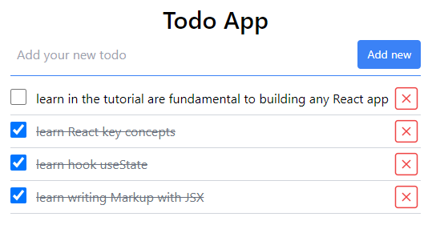

# React DOM компоненты - компоненты форм

React поддерживает все встроенные в браузер компоненты HTML и SVG.

📚 Содержание:

- [Что такое контролируемый компонент](#controlled-component)
- [Компонент формы `<input>`](#компонент-формы-input)
- [Компонент формы `<select>`](#компонент-формы-select)
- [Компонент формы `<textarea>`](#компонент-формы-textarea)
- [Challenge: Приложение `Todo App`](#challenge-приложение-todo-app)

### Controlled component

Встроенные компоненты браузера `<input>`, `<select>` и `<textarea>`принимают вводимые пользователем данные. Это
особенные компоненты в React, потому что передача им значения в виде атрибута (пропса) делает их контролируемыми.

💡 **Контролируемый компонент** (`Controlled component`) в React - это компонент, значение которого управляется React.
Обычно это достигается через использование состояния (state) компонента, чтобы хранить значение компонента и обновлять
его в соответствии с пользовательским вводом.

```jsx
<input value={myInputValue} />
```

_Здесь и дале по тексту `компонент формы` будет ссылаться на `элемент формы` и наоборот._

## Компонент формы `<input>`

Встроенный в браузер компонент (built-in browser component) `<input>` позволяет отображать и вводить различные типы
входных данных формы.

💡 Встроенный в браузер компонент `<input>` поддерживает
все [общие атрибуты элементов](https://react.dev/reference/react-dom/components/common#props).

```jsx
<input name="myInput" />
```

Вы можете сделать input управляемым, передав в него один из этих атрибутов (пропсов):

- `checked` - логическое значение. Для флажков `checkbox` и переключателей `radio button`, этот атрибут определяет,
  помечен (выбран) ли заранее элемент.
- `value` - строка. Управляет текстовым значением элемента. (Для переключателя `radio button` определяет данные формы).

💡 При передаче любого атрибута `checked` или `value`, нужно так же передать обработчик события `onChange`, который
,будет обновлять переданное значение (State).

Следующие атрибуты (пропсы) `<input>` актуальны только если компонент определен как неконтролируемый:

- `defaultChecked`: логическое значение. Определяет начальное значение для флажков `type="checkbox"` и
  переключателей `type="radio"`.
- `defaultValue`: строка. Определяет начальное значение для текстового ввода.

### Отображение `<input>` разных типов

Чтобы отобразить ввод, визуализируйте компонент `<input>`. По умолчанию это будет текстовый ввод `type="text"`. Вы
можете передать `type="checkbox"` для флажка, `type="radio"` для переключателя или один из
других [доступных типов](https://developer.mozilla.org/en-US/docs/Web/HTML/Element/input#input_types).

```jsx
export const MyForm = () => {
  return (
    <>
      <label>
        Text input: <input name="myInput" />
      </label>
      <hr />
      <label>
        Checkbox: <input type="checkbox" name="myCheckbox" />
      </label>
      <hr />
      <p>
        Radio buttons:
        <label>
          <input type="radio" name="myRadio" value="option1" />
          Option 1
        </label>
        <label>
          <input type="radio" name="myRadio" value="option2" />
          Option 2
        </label>
        <label>
          <input type="radio" name="myRadio" value="option3" />
          Option 3
        </label>
      </p>
    </>
  );
};
```

### Создание метки `<label>` для элемента `<input>`

Обычно каждый элемент `<input>` помещается внутри тега `<label>`. Это сообщает браузеру, что эта метка связана с этим
вводом. Когда пользователь нажимает на метку, браузер автоматически фокусирует ввод. Это также важно для
доступности (`Accessibility`): программа чтения с экрана объявляет заголовок метки, когда пользователь фокусирует
соответствующий ввод.

Если нет возможности вложить `<input>` в `<label>`, свяжите их, передав один и тот же идентификатор ()`id`)
в `<input id>` и `<label htmlFor>`. Чтобы избежать конфликтов между несколькими экземплярами одного компонента,
сгенерируйте такой идентификатор с помощью `React.useId()`.

```jsx
import { useId } from 'react';

export const Form = () => {
  const ageInputId = useId();

  return (
    <>
      <label>
        Your first name:
        <input name="firstName" />
      </label>
      <hr />
      <label htmlFor={ageInputId}>Your age:</label>
      <input id={ageInputId} name="age" type="number" />
    </>
  );
};
```

### Установка начального значения для `<input>`

Можно указать начальное значение для любого элемента `<input>`. Достаточно передать его как строку в атрибут (
пропс) `defaultValue` для текстового типа `<input>`.

Для флажков `type="checkbox"` и переключателей `type="radio"` начальное значение указывается с помощью логического
значения для атрибута (пропса) `defaultChecked`.

```jsx
export const MyForm = () => {
  return (
    <>
      <label>
        Text input: <input name="myInput" defaultValue="Some initial value" />
      </label>
      <hr />
      <label>
        Checkbox: <input type="checkbox" name="myCheckbox" defaultChecked={true} />
      </label>
      <hr />
      <p>
        Radio buttons:
        <label>
          <input type="radio" name="myRadio" value="option1" />
          Option 1
        </label>
        <label>
          <input type="radio" name="myRadio" value="option2" defaultChecked={true} />
          Option 2
        </label>
        <label>
          <input type="radio" name="myRadio" value="option3" />
          Option 3
        </label>
      </p>
    </>
  );
};
```

### Чтение значений `<input>` при отправке формы

💡 По умолчанию при отправке формы `<form>` через нажатие кнопки `<button type="submit">`, будет вызван обработчик
событий `<form onSubmit>`, браузер отправит данные формы на текущий URL-адрес и обновит страницу.

Можно переопределить это поведение, вызвав `e.preventDefault()` и прочитать данные формы с
помощью `new FormData(e.target)`.

```jsx
export const MyForm = () => {
  function handleSubmit(e) {
    // Prevent the browser from reloading the page
    e.preventDefault();

    // Read the form data
    const form = e.target;
    const formData = new FormData(form);

    // You can pass formData as a fetch body directly:
    fetch('/some-api', {method: form.method, body: formData});

    // Or you can work with it as a plain object:
    const formJson = Object.fromEntries(formData.entries());

    console.log(formJson);
  }

  return (
    <form method="post" onSubmit={handleSubmit}>
      <label>
        Text input: <input name="myInput" defaultValue="Some initial value" />
      </label>
      <hr />
      <label>
        Checkbox: <input type="checkbox" name="myCheckbox" defaultChecked={true} />
      </label>
      <hr />
      <button type="reset">Reset form</button>
      <button type="submit">Submit form</button>
    </form>
  );
};
```

Если дать имя каждому элементу формы, например `<input name="firstName" defaultValue="Taylor" />`, то указанное имя
будет использоваться в качестве ключа в данных формы, например `{ firstName: "Taylor" }`.

```jsx
// Read the form data
const form = e.target;
const formData = new FormData(form);

console.log(formData.firstName);
```

💡 По умолчанию любая кнопка `<button>` внутри `<form>` делает ее отправку `<form onSubmit>`. Если вы создали
пользовательский компонент React `<Button>`, то нужно предусмотреть возможность возврата `<button type="button">`
вместо `<button>` без явного указания типа. Для кнопок, которые должны отправлять используйте
используйте `<button type="submit">`, это определит порядок и четкие правила с явным указанием какая кнопка отвечает за
отправку формы.

### Управление `<input>` с помощью переменной состояния

По умолчанию компонент типа `<input />` неконтролируемый. Даже если вы передаете начальное значение,
например `<input defaultValue="Initial text" />`, JSX указывает только начальное значение и потом уже никак не
контролирует его.

Чтобы выполнить рендер (визуализировать) контролируемого компонента типа `<input />`, ему нужно передать пропс (
атрибут) `value` (или `checked` для флажков `type="checkbox"` и переключателей `type="radio"`). Тогда React будет всегда
контролировать значение через переданный пропс `value`.

Обычно это можно сделать, объявив переменную состояния через вызов хука `useState`:

```jsx
const MyForm = () => {
  // Объявление переменной состояния
  const [firstName, setFirstName] = useState('');
  // ...

  // Связать значение input с переменной состояния
  // ... и обновлять переменную состояния при любых изменениях!
  return <input value={firstName} onChange={(e) => setFirstName(e.target.value)} />;
};
```

💡 Значение, которое вы передаете управляемым компонентам, не должно быть `undefined` или `null`. Если вам нужно, чтобы
начальное значение было пустым, то инициализируйте переменную состояния пустой строкой `useState('')` как в примере
выше.

💡 Если вы хотите управлять вводом при помощи переменной состояния, то вы должны обязательно передать обработчик
событий `onChange`.

```jsx
// 🔴 Bug: controlled text input with no onChange handler
<input value={something} />

// ✅ Good: uncontrolled input with an initial value
<input defaultValue={something} />

// ✅ Good: controlled input with onChange
<input value={something} onChange={e => setSomething(e.target.value)} />

// ✅ Good: readonly controlled input without on change
<input value={something} readOnly={true} />

```

Примеры с `type="checkbox"`

```jsx
// ✅ Good: uncontrolled checkbox with an initial value
<input type="checkbox" defaultChecked={something} />

// ✅ Good: controlled checkbox with onChange
<input type="checkbox" checked={something} onChange={e => setSomething(e.target.checked)} />

// ✅ Good: readonly controlled input without on change
<input type="checkbox" checked={something} readOnly={true} />
```

⚠️ Переменную состояния контролируемого компонента нельзя обновлять асинхронно.

```jsx
const handleChange = (e) => {
  // 🔴 Bug: updating an input asynchronously
  setTimeout(() => {
    setFirstName(e.target.value);
  }, 100);
};

const handleChange = (e) => {
  // ✅ Updating a controlled input to e.target.value synchronously
  setFirstName(e.target.value);
};
```

### Оптимизация повторного рендеринга при каждом нажатии клавиши

Когда вы используете контролируемый ввод, вы устанавливаете состояние при каждом нажатии клавиши. Если компонент,
содержащий ваше состояние, повторно отображает большое дерево, это будет сказываться на производительности:

```jsx
const App = () => {
  const [firstName, setFirstName] = useState('');

  return (
    <>
      <form>
        <input value={firstName} onChange={(e) => setFirstName(e.target.value)} />
      </form>
      <PageContent />
    </>
  );
};
```

Обновление состояния вызванное методом из хука `useState` приводит к повторному рендеренгу компонента и всех его
потомков.

Поскольку `<PageContent />` не зависит от состояния ввода, то форму с вводом можно вынести в отдельный компонент:

```jsx
// src/components/my-forms.jsx
const MyForm = () => {
  const [firstName, setFirstName] = useState('');
  return (
    <form>
      <input value={firstName} onChange={(e) => setFirstName(e.target.value)} />
    </form>
  );
};

// src/app/app.jsx
const App = () => {
  return (
    <>
      <MyForm />
      <PageContent />
    </>
  );
};
```

Это значительно повышает производительность, поскольку теперь при каждом нажатии клавиши перерисовывается только
компонент `<MyForm />`. Еще один из методов оптимизации повторного рендеринга это использование
хука [useDeferredValue](https://react.dev/reference/react/useDeferredValue#deferring-re-rendering-for-a-part-of-the-ui).

[⬆ Back to Top](#react-dom-компоненты---компоненты-форм)

## Компонент формы `<select>`

Встроенный в браузер компонент `<select>` позволяет отображать поле выбора с параметрами `<option>`.

```jsx
<select>
  <option value="someOption">Some option</option>
  <option value="otherOption">Other option</option>
</select>
```

Встроенный в браузер компонент `<select>` так же поддерживает все
общие [атрибуты (пропсы) элементов](https://react.dev/reference/react-dom/components/common#props).

Компонент `<select>` можно сделать управляемым, передав переменную состояния в качестве значение в атрибут `value`.

### Установка начального значения для `<seclect>`

По умолчанию браузер выберет первый `<option>` в списке. Чтобы выбрать другой параметр по умолчанию, передайте значение
этого `<option>` как `defaultValue` элементу `<select>`.

```jsx
const FruitPicker = () => {
  return (
    <label>
      Pick a fruit:
      <select name="selectedFruit" defaultValue="orange">
        <option value="apple">Apple</option>
        <option value="banana">Banana</option>
        <option value="orange">Orange</option>
      </select>
    </label>
  );
}
```

⚠️ В отличие от HTML, передача выбранного атрибута в отдельный `<option>` не поддерживается.

### Управление `<select>` с помощью переменной состояния

По умолчанию компонент `<select>`, не контролируется. Даже если передать в него изначально выбранное значение,
например `<select defaultValue="orange">`.

⚠️ Передача значения для `defaultValue` не делает компонент формы контролируем.

Чтобы сделать `<select>` контролируемым компонентом, передайте ему свойство `value`.
Обычно это делается через объявление переменной состояния:

```jsx
const FruitPicker = () => {
  const [selectedFruit, setSelectedFruit] = useState('apple');

  return (
    <label>
      Pick a fruit:
      <select name="selectedFruit" value={selectedFruit} onChange={(e) => setSelectedFruit(e.target.value)}>
        <option value="apple">Apple</option>
        <option value="banana">Banana</option>
        <option value="orange">Orange</option>
      </select>
    </label>
  );
};
```

Когда вы передаете значение, вы также должны передать обработчик событий `onChange`, который будет обновлять переданное
значение.

⚠️ Если при объявлении переменной состояния в `useState` аргументом будет передана пустая строка, то по умолчанию
значение для переменной состояния будет отсутствовать, в элементе `<select>` будет выбран первый элемент `<option>` в
списке. Такое поведение может вызвать нежелательные эффекты, если вы попытаетесь считать значение переменной состояния
до того как произойдет первое изменение по событию `onChange`.

Пример с повторным отображением некоторой части пользовательского интерфейса в ответ на каждый выбор:

```jsx
import { useState } from 'react';

export const FruitPicker = () => {
  const [selectedFruit, setSelectedFruit] = useState('orange');

  const [selectedVegs, setSelectedVegs] = useState(['corn', 'tomato']);

  return (
    <>
      <label>
        Pick a fruit:
        <select
          value={selectedFruit}
          onChange={e => setSelectedFruit(e.target.value)}
        >
          <option value="apple">Apple</option>
          <option value="banana">Banana</option>
          <option value="orange">Orange</option>
        </select>
      </label>

      <hr />

      <label>
        Pick all your favorite vegetables:
        <select
          multiple={true}
          value={selectedVegs}
          onChange={e => {
            const options = [...e.target.selectedOptions];
            const values = options.map(option => option.value);
            setSelectedVegs(values);
          }}
        >
          <option value="cucumber">Cucumber</option>
          <option value="corn">Corn</option>
          <option value="tomato">Tomato</option>
        </select>
      </label>

      <hr />

      <p>Your favorite fruit: {selectedFruit}</p>
      <p>Your favorite vegetables: {selectedVegs.join(', ')}</p>
    </>
  );
}

```

❌ Если вы передаете `value` без `onChange`, элемент `<select>` перестанет работать - значение `<option>` из списка
выбрать будет невозможно.

💡Если вы делаете компонент управляемым при помощи передачи `value`, то вы так же должны передавать обработчик события
в `onChange`.

⚠️ В отличие от HTML, передача выбранного атрибута в отдельный `<option>` не поддерживается.

[⬆ Back to Top](#react-dom-компоненты---компоненты-форм)

## Компонент формы `<textarea>`

Встроенный в браузер компонент `<textarea>` позволяет отображать многострочный ввод текста.

```jsx
<textarea name="postContent" />
```

Вы можете сделать `<textarea>` контролируемым, передав атрибут `value`:

- `value`: Строка. Контролирует текст внутри текстовой области `<textarea>`.

⚠️ Если вы передаете атрибут `value`, вы должны так же передать обработчик событий `onChange` для обновления
значения `value`.

Если компонент `<textarea>` не контролируемый, то вы можете передать `defaultValue`:

- `defaultValue`: строка. Определяет начальное значение для `<textarea>`.

### ⚠️️ Предостережения

- Передача дочерних элементов типа `<textarea>something</textarea>` не разрешена. Используйте `defaultValue` для
  исходного содержимого.
- Если `<textarea>` получает атрибут `value`, то компонент становится контролируемым.
- Компонент `<textarea>` не может быть одновременно контролируемым и неконтролируемым.
- Компонент `<textarea>` не может переключаться между контролируемым и неконтролируемым состоянием в течение своего
  существования.
- Каждому контролируемому `<textarea>` необходим обработчик событий `onChange`, который синхронно обновляет значение
  переменной состояния.

### Установка начального значения для `<textarea>`

При желании вы можете указать начальное значение для `<textarea>`. Передайте его как строку для `defaultValue`.

```jsx
const EditPost = () => {
  return (
    <label>
      Edit your post:
      <textarea
        name="postContent"
        defaultValue="I really enjoyed biking yesterday!"
        rows={4}
        cols={40}
      />
    </label>
  );
};
```

❌ В отличие от HTML, передача исходного текста, например `<textarea>Некоторый контент</textarea>`, не поддерживается.

### Управление `<textarea>` с помощью переменной состояния

По умолчанию `<textarea>` неконтролируемый и передача начального значения в
виде `<textarea defaultValue="Initial text" />` не делает его таковым.

Чтобы визуализировать контролируемый компонент `<textarea>`, передайте ему атрибут `value`. Обычно это делается при
помощи объявления переменной состояния:

```jsx
const NewPost = () => {
  const [postContent, setPostContent] = useState(''); // Declare a state variable...
  // ...
  return (
    <textarea
      value={postContent} // ...force the input's value to match the state variable...
      onChange={e => setPostContent(e.target.value)} // ... and update the state variable on any edits!
    />
  );
};
```

### Примеры использования `<textarea>`

```jsx
// 🔴 Неправильно: в контролируемом компоненте отсутствует обработчик onChange
<textarea value={something} />

// ✅ Правильно: неконтролируемый компонент с начальным значением
<textarea defaultValue={something} />

// ✅ Правильно: контролируемый компонент с value и onChange
<textarea value={something} onChange={e => setSomething(e.target.value)} />

// ✅ Правильно: контролируемый компонент только для чтения без onChange
<textarea value={something} readOnly={true} />
```

### Сообщение об ошибке: “A component is changing an uncontrolled input to be controlled”

Если вы предоставляете `value` компоненту, оно должно оставаться строкой на протяжении всего своего существования.

Вы не можете сначала передать `value={undefined}`, а затем передать `value="some string"`, потому что React не будет знать,
хотите ли вы, чтобы компонент был неконтролируемым или контролируемым. Управляемый компонент всегда должен получать
значение `value` в виде строки, а не `null` или `undefined`.

Если вы передаете значение `value` из API или переменной состояния, оно может быть инициализировано значением `null` или
`undefined`. В этом случае либо изначально установите для него пустую строку (''), либо передайте
`value={someValue ??  ''},` чтобы убедиться, что значение является строкой.

[⬆ Back to Top](#react-dom-компоненты---компоненты-форм)

## Challenge: Приложение `Todo App`

Напишите приложение Todo на основе полученных знаний из первых девяти разделов (_chapter-01...chapter-09_)

- Приложение должно состоять минимум из трех компонентов:
  - Список Todo;
  - Todo как отдельный элемент списка;
  - Форма для добавления Todo;
- Форма для добавления Todo содержит управляемый компонент (элемент) `<input>` (использование useState внутри
  компонента)
- Форма для добавления Todo может содержать другие компоненты, общие для всего приложения (например `<Button />`)
- Компонент `<App />` управляет компонентом формы и списка Todo (реализует бизнес логику для списка Todo)
- Для хранения списка Todo используется переменная состояния (useState) в `<App />`

🔗 [Пример приложения](https://todo-app-ab1e50.netlify.app/)



Готовый пример с приложением находится в `src` раздела chapter-09.

Для запуска примера с готовым приложением выполните команды:

```shell
git clone https://github.com/shopot/react-101.git

git checkout chapter-09

npm install

npm run dev
```

Документация по теме:

- 🔗 [Common components (e.g. `<div>`)](https://react.dev/reference/react-dom/components/common)
- 🔗 [Component `<input>`](https://react.dev/reference/react-dom/components/input)
- 🔗 [Component `<select>`](https://react.dev/reference/react-dom/components/select)
- 🔗 [Component `<textarea>`](https://react.dev/reference/react-dom/components/textarea)
- 🔗 [useDeferredValue](https://react.dev/reference/react/useDeferredValue#deferring-re-rendering-for-a-part-of-the-ui)

[⬆ Back to Top](#react-dom-компоненты---компоненты-форм)

```

```
