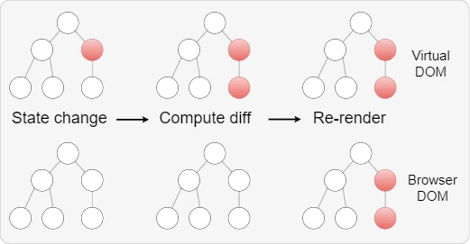

# Отрисовка элементов

Элементы - это самые маленькие строительные блоки приложений React.

Элемент описывает, что вы хотите видеть на экране:

```jsx
const element = <h1>Hello, world</h1>;
```

В отличие от DOM-элементов браузера, элементы React это обычные объекты JavaScript. `React DOM` берёт заботу по обновлению DOM на себя для соответствия элементам React.

API-интерфейсы `react-dom/client` позволяют отображать компоненты React на клиенте (которые запускаются в среде DOM браузера). Эти API обычно используются на верхнем уровне вашего приложения для инициализации вашего дерева React.

Предположим, что в вашем файле HTML есть `<div>`:

```jsx
<div id="root"></div>
```

Мы называем это «корневым» узлом DOM, потому что всё внутри него будет управляться `DOM React`.

Для отрисовки элемента React в корневом узле DOM необходимо сначала создать ReactDOMRoot объект для отображения компонента внутри DOM браузера:

```js
const root = ReactDOM.createRoot(domNode, options?);
```

Метод `ReactDOM.createRoot()` возвращает объект типа `Root`

```ts
export interface Root {
  render(children: React.ReactNode): void;
  unmount(): void;
}
```

Который содержит метод `render()` для отображения части `JSX` элемента (`React node`) внутри узла DOM браузера:

```js
import { createRoot } from 'react-dom/client';

const root = createRoot(document.getElementById('root'));

root.render(<h1>Hello, React!</h1>);
```

### Обновление отрисованного элемента

React-элементы - неизменяемы (Immutable). Создав однажды элемент, вы не сможете изменить его дочерние элементы или атрибуты. Элемент похож на один кадр в фильме: он представляет собой пользовательский интерфейс в определённый момент времени.

Единственный способ обновить интерфейс - создать новый элемент и передать его в метод `render()`.

```jsx
import { createRoot } from 'react-dom/client';

const root = createRoot(document.getElementById('root'));

const tick = () => {
  const element = (
    <div>
      <h1>Привет, мир!</h1>
      <h2>Сейчас {new Date().toLocaleTimeString()}.</h2>
    </div>
  );

  root.render(element);
};

setInterval(tick, 1000);
```

DOM React сравнивает элемент и его дочерние элементы с предыдущими и применяет только обновления DOM, необходимые для преобразования DOM в желаемое состояние.

Несмотря на то, что мы создаём элемент, описывающий всё дерево пользовательского интерфейса на каждом тике, только текстовый узел, содержимое которого изменилось, обновляется в DOM React.


### Virtual DOM (виртуальное дерево объектов)

Virtual DOM (виртуальное дерево объектов) - это концепция, используемая во фреймворках и библиотеках JavaScript.

Основная идея Virtual DOM заключается в том, что браузерное представление веб-страницы представлено в виде дерева объектов (DOM), и каждое изменение в этом дереве может привести к перерисовке всего представления страницы.



Виртуальный DOM является абстракцией на основе JavaScript, представляющей собой копию реального DOM в памяти. При изменении состояния приложения, виртуальный DOM сравнивается со старым состоянием, вычисляется разница и только те изменения, которые должны быть внесены в реальный DOM, применяются. Это позволяет существенно уменьшить количество перерисовок элементов страницы, часто ускоряет рендеринг страниц и повышает производительность приложения.

Дополнительная информация:

- 🔗 [React Fiber Architecture (2016)](https://github.com/acdlite/react-fiber-architecture)
- 🔗 [React - Basic Theoretical Concepts (2016)](https://github.com/reactjs/react-basic)

### React UI tree

React использует древовидные структуры для управления и моделирования создаваемого вами пользовательского интерфейса. React создает `UI tree` из вашего JSX. Затем React DOM обновляет элементы DOM браузера, чтобы они соответствовали этому `UI tree`.


Для сравнения дерева элементов, React реализует эвристический алгоритм O(n), основанный на двух предположениях:

- Разные типы компонентов предполагают генерацию существенно разных деревьев. React не будет пытаться сравнить их, а просто заменит старое дерево полностью .
- Различие списков производиться с использованием ключей (keys). Ключи должны быть «постоянными, предсказуемыми и уникальными».

На практике эти предположения справедливы практически для всех практических случаев использования.

Документация по теме:

- 🔗 [Preserving and Resetting State - Описание работы алгоритма обновления Dom tree](https://react.dev/learn/preserving-and-resetting-state)

**[⬆ Back to Top](#отрисовка-элементов)**
