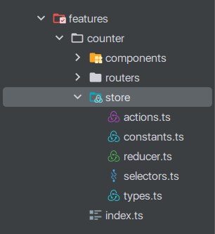

# Знакомство с Redux

📚 Содержание

* [Что такое Redux?](#что-такое-redux)
* [Три фундаментальных принципа Redux](#три-фундаментальных-принципа-redux)
* [Когда следует использовать Redux?](#когда-следует-использовать-redux)
* [Основные понятия](#основные-понятия)
  * [State](#state)
  * [Actions](#actions)
  * [Reducer](#reducer)
  * [Store](#store)
  * [dispatch](#dispatch)
  * [Selectors](#selectors)
  * [Developer Tools](#developer-tools)
* [Что такое поток данных в Redux?](#что-такое-поток-данных-в-redux)
* [Из чего состоит Redux Core?](#из-чего-состоит-redux-core)
* [Библиотека React Redux](#библиотека-react-redux)
  * [Provider](#provider)
  * [useSelector](#useselector)
  * [useDispatch](#usedispatch)
* [Пример использования Redux на JavaSCript](#пример-использования-redux-на-javascript)
* [Пример реализации App Counter](#пример-реализации-app-counter)
  * [Структура проекта](#структура-проекта)
  * [constants](#constants)
  * [types](#types)
  * [actions](#actions-1)
  * [reducer](#reducer-1)
  * [selectors](#selectors-1)
  * [Создание Redux Store](#создание-redux-store)
  * [Подключение Redux Store к React](#подключение-redux-store-к-react)
  * [Доступ к состоянию из компонентов Redux через useSelector](#доступ-к-состоянию-из-компонентов-redux-через-useselector)
  * [Оправка действий в Redux Store](#оправка-действий-в-redux-store)
  * [Создание асинхронных действий (Async Actions)](#создание-асинхронных-действий-async-actions)
  * [Подключение redux-thunk](#подключение-redux-thunk)
* [Об экосистеме Redux](#об-экосистеме-redux)
* [Пример приложения Counter App](#пример-приложения-counter-app)

## Что такое Redux?

Redux - это библиотека для управления состоянием приложения в JavaScript.

Redux предоставляет предсказуемый и однонаправленный поток данных в приложении. Он основан на концепции
однонаправленного потока данных, которая подразумевает, что данные в приложении имеют одну единственную точку входа и
одну единственную точку выхода. Эта концепция была заимствована из архитектурного
паттерна [Flux](https://github.com/facebookarchive/flux).

[Flux Concepts by Facebook](https://github.com/facebookarchive/flux/blob/main/examples/flux-concepts/README.md)

[An introduction to the Flux architectural pattern by Cristian Salcescu ](https://www.freecodecamp.org/news/an-introduction-to-the-flux-architectural-pattern-674ea74775c9/)

⬆ [Back to Top](#знакомство-с-redux)

## Три фундаментальных принципа Redux

1. **Единственный источник правды**

   Состояние всего вашего приложения хранится в дереве объектов в одном хранилище.
2. **Состояние только для чтения**

   Единственный способ изменить состояние – это создать действие, объект, описывающий произошедшее.
3. **Изменения вносятся с помощью чистых функций**

   Для того чтобы определить, как действия (запросы на изменение состояния) влияют на общее состояние вашего приложения,
   вы пишете редюсеры - функции, которые, получив текущее состояние и некоторое действие, возвращают обновленное
   состояние.

[Redux docs: Three Principles](https://redux.js.org/understanding/thinking-in-redux/three-principles)

⬆ [Back to Top](#знакомство-с-redux)

## Когда следует использовать Redux?

Redux помогает вам управлять данными через глобальное состояние приложения, но, как и у любого инструмента, у него есть
компромиссы.

Redux более полезен, когда:

- У вас есть большие части состояния приложения, которые необходимы во многих местах приложения;
- Состояние приложения часто обновляется с течением времени;
- Логика обновления состояния может быть сложной;
- Приложение имеет кодовую базу среднего или большого размера, и над ним может работать команда из нескольких человек;

> Не всем приложениям нужен Redux. Потратьте некоторое время, чтобы подумать о типе приложения, которое вы создаете, и
> решить, какие инструменты лучше всего помогут решить проблемы, над которыми вы работаете.

⬆ [Back to Top](#знакомство-с-redux)

## Основные понятия

### State

**Состояние** 

* Это данные приложения
  * в том виде, в каком они существует в памяти
* Мы определяем
  * Вид данных
  * Начальное значение
* Состояние принадлежит **Store**
```js
const appState = {
  todos: [
    { text: 'Consider using Redux', completed: true },
    { text: 'Keep all state in a single tree', completed: false },
  ],
  visibilityFilter: 'SHOW_ALL',
};
```


### Actions

**Actions** (действия)

* Пользовательское событие (действие), которое вызывается (отправляется)
* Простой JavaScript объект со свойством `type`
* Помимо `type` может иметь и другие поля с дополнительной информацией, вам решать, каким будет структура объекта
* По соглашению дополнительная информация помещается в поле, называемое `payload`

**Action Types** (типы действий)

* Типы обычно следует определять как строковые константы
* Имена типов действий принимают форму:
  * VERB_**ENTITY**_[ REQUEST | SUCCESS | FAILURE ] 
  * Пример:
    * ADD_TODO
    * REMOVE_TODO
    * LOAD_PHOTOS_REQUEST
    * LOAD_PHOTOS_SUCCESS
    * LOAD_PHOTOS_FAILURE

```js
// Представление константы типа
const ADD_TODO = 'ADD_TODO'

// Как будет представлен объект
{ type: ADD_TODO, payload: 'Learn Redux' }
```

**Action Creators** (Генератор экшенов/действий)

* Функции, которые создают объект действия
* Делает их портативными и упрощает тестирование
* Удобно использовать для выполнении асинхронной логики

```js
const addTodo = (text) => ({
  type: ADD_TODO,
  payload: text,
});
```

### Reducer

* Функция
  * Принимает два параметра: `state` и `action`
  * Возвращает новый `state`
* Общепринято использовать внутри `switch..case` конструкцию для реализации логики
* Неизменный (immutable)
  * Поэтому функции отладки работают правильно
* Всегда устанавливайте состояние по умолчанию
  * Обрабатывается в `default case` конструкции `switch..case` 
* Если вы хотите разделить логику обработки данных, создайте несколько функций-редюсеров и объедините их в один редюсер более высокого уровня (Root Reducer).

> Функции "Reducer" получили свое название, потому что они похожи на функцию обратного вызова, которую вы передаете методу `Array.reduce()`.

Функции-редюсеры всегда должны следовать некоторым определенным правилам:

- Новое состояние вычисляется всегда только на основе аргументов `state` и `action`.
- Им не разрешено изменять `state` напрямую. Вместо этого они должны делать _immutable updates_, копируя существующее состояние и внося изменения в скопированные значения.
- Они не должны выполнять какую-либо асинхронную логику, вычислять случайные значения или вызывать другие "side effects".

Пример функции reducer:

```js
const initialState = { value: 0 };

const counterReducer = (state = initialState, action) => {
  switch (action.type) {
    case INCREMENT: {
      return {
        ...state, 
        value: state.value + 1
      }
    }

    case DECREMENT: {
      return {
        ...state,
        value: state.value - 1
      }
    }
    
    default: {
      return  state;
    }
  }
};
```

### Store


* `Store` это объект, который позволяет другим концепциям работать вместе.
* `Store` выполняет следующие обязанности:
  * Хранит состояние приложения 
  * Разрешает доступ к состоянию через метод `getState()`
  * Позволяет обновлять состояние через вызов `dispatch(action)`
  * Регистрирует подписчиков на изменения через `subscribe(listener)`
  * Обрабатывает отмену регистрации подписчиков с помощью функции, возвращаемой из `subscribe(listener)`.

```js
import { createStore } from 'redux'

const store = createStore(counterReducer)

console.log(store.getState())
// {value: 0}
```

Метод `createStore` входит в состав Redux Core (`redux`) и использовался до появления библиотеки Redux
Toolkit (`@reduxjs/toolkit`)

❗`createStore` является устаревшим, вместо него сейчас используется метод `configureStore` вместе с библиотекой
`@reduxjs/toolkit`:

### dispatch

* Единственный способ обновить состояние это вызвать `store.dispatch(action)` и передать объект `action`.
* `dispatch` может принимать объект `action` или функцию обратного вызова содержащую другой вызов `dispatch(action)`

```js
store.dispatch({type: 'counter/INCREMENT'})

console.log(store.getState())
// {value: 1}
```

Вы можете думать об отправке `action` через метод `dispatch` как о "запуске события" в приложении. Что-то произошло, и
мы хотим, чтобы `Store` знал об этом. Функции редюсеры действуют как прослушиватели событий: когда они получают
интересующее их действие, они в ответ обновляют состояние.

### Selectors

* Используются для извлечения определенных данных из глобального состояния приложения без необходимости напрямую обращаться к структуре данных внутри `Store`
* Могут быть объединены и использованы для создания более сложных селекторов. Это позволяет создавать композируемые функции выборки данных и повторно использовать их в различных частях приложения.

```js
const selectCounterValue = state => state.value

const currentValue = selectCounterValue(store.getState())

console.log(currentValue)
// 2
```

В связке с библиотекой `reselect`, использование селекторов становится ещё более эффективным. `reselect` предоставляет мемоизацию (кэширование) для селекторов, что позволяет избежать повторных вычислений, если входные данные не изменились.

### Developer Tools

* Обеспечивает более широкие возможности отладки, включая:
  * Отслеживание изменений состояния:
      * Redux DevTools позволяют разработчикам в реальном времени следить за изменениями состояния Redux в их приложении. Это особенно полезно при отладке, поскольку вы можете видеть, какие действия (actions) приводят к изменению состояния и какие данные обновляются. 
  * Путешествие в прошлое (Time Travel):
      * Одним из важных возможностей Redux DevTools является "путешествие в прошлое" или "машинное время". Разработчики могут перематывать назад и вперёд через предыдущие состояния приложения, чтобы понять, как и почему произошли определенные изменения. Это мощный инструмент для воссоздания и анализа прошлых состояний приложения.
  * Инспекция действий (Actions):
      * Redux DevTools позволяют просматривать и анализировать все действия (actions), которые были отправлены в систему Redux. Это помогает в понимании того, какие события происходят в приложении и в каком порядке.
  * Мониторинг производительности:
      * Инструменты разработки Redux также могут использоваться для мониторинга производительности приложения. Вы можете измерять время, затраченное на выполнение различных действий и изменения состояния, что может быть полезно при оптимизации производительности.
  * Интеграция с множеством сред разработки:
      * Redux DevTools интегрируются с различными средами разработки, включая браузерные расширения для Chrome и Firefox, а также встроенные встроенные пакеты для npm, что делает их легкими в использовании в различных окружениях разработки.

## Что такое поток данных в Redux?

В основе Redux лежит концепция основанная на одностороннем потоке данных, который описывает такую последовательность
шагов по обновлению приложения:

- `State` описывает состояние приложения в определенный момент времени;
- Пользовательский интерфейс отображается на основе этого состояния;
- Когда что-то происходит (например, пользователь нажимает кнопку), состояние обновляется в зависимости от того, что
  произошло;
- Пользовательский интерфейс перерисовывается на основе нового состояния;

В частности, для Redux можно разбить эти шаги более детально:

- В приложении что-то происходит, например, когда пользователь нажимает кнопку;
- Код приложения отправляет `action` в `Redux Store`, например `dispatch({type: 'counter/INCREMENT'})`;
- `Store` снова запускает функцию-редюсера с предыдущим состоянием и текущим действием и сохраняет возвращаемое значение
  как новое состояние.
- `Store` уведомляет все части пользовательского интерфейса, которые подписаны на обновление данных, что данные в `Store` обновлены.
- Каждый компонент пользовательского интерфейса, которому нужны данные из `Store`, проверяет, не изменились ли нужные им
  части состояния.
- Каждый компонент, который видит, что его данные изменились, вызывает повторный рендеринг с новыми данными, чтобы он
  мог
  обновить то, что отображается на экране.

Вот как этот поток данных выглядит визуально:


⬆ [Back to Top](#знакомство-с-redux)

## Из чего состоит Redux Core?

> Первое, что нужно спросить: "Что такое Redux?"

Redux на самом деле это:

- Единственное хранилище в виде объекта `Store`, содержащее "глобальное" состояние приложения;
- Отправка простых объектов `actions` через метод `dispatch` в `Store`, когда что-то происходит в приложении;
- Чистые функции редюсеры, отслеживающие эти действия и возвращающие _immutably updated_ состояние;

Redux Core (пакет `redux`) - это маленькая библиотека, которая предоставляет несколько небольших API методов:

- `createStore` - используется для создания хранилища Redux, на данный момент устаревший, вместо него нужно использовать `configureStore` из пакетв `@reduxjs/toolkit`
- `combineReducers` - используется для объединения нескольких функций редюсеров в один редюсер, его еще
  называют `Root Reducer`.
- `applyMiddleware` - используется для объединения нескольких `middleware` в `store enhancer`
- `compose` - используется для объединения нескольких `store enhancer` в один `store enhancer`.

Реализация состояния при помощи Redux Core (без использования Redux Toolkit) обычно включает в себя следующий код:

- Генераторы действий (Action creators), которые генерируют объекты `actions`;
- Middleware для включения побочных эффектов `side effects`;
- Функции `Thunk`, содержащие синхронную или асинхронную логику с побочными эффектами;
- Нормализованное состояние, позволяющее искать элементы по ID;
- Мемоизированные функции выбора с библиотекой `Reselect` для оптимизации получаемых данных;
- Расширение `Redux DevTools` для просмотра истории ваших действий и изменений состояния в браузере;
- TypeScript типы для `actions`, `satate` и других функций и объектов для реализации `Redux Store`;

Хорошей новостью является то, что Redux можно использовать по-разному. Плохая новость заключается в том, что нет
помощников, которые могли бы облегчить написание вашего кода, то есть использование базового Redux предполагает
написание большого количества шаблонного кода в виде констант, генераторов, асинхронных действий, middleware и тд.

Для исправления этой ситуации в Redux есть библиотека [Redux Toolkit](https://redux-toolkit.js.org/), которая упрощает написание шаблонного кода.

## Библиотека React Redux

Кроме того, Redux обычно используется с библиотекой [React Redux](https://react-redux.js.org/) (`react-redux`), чтобы
ваши компоненты React могли взаимодействовать с хранилищем Redux. Использование `react-redux` доступно с React начиная с
версии React 16.8.3.

Библиотека React-Redux предоставляет следующее API:

### Provider

`<Provider />` - это компонент обертка, который делает `Redux Store` доступным для остальной части вашего приложения:

```js
import { Provider } from 'react-redux';

import store from './store';
import { Counter } from '@/features/counter';

const App = () => {
  return (
    <Provider store={store}>
      <div className={styles.appContainer}>
        <h1 className={styles.header}>Counter App</h1>
        <Counter />
      </div>
    </Provider>
  );
};

```

### useSelector

Хук `useSelector()` считывает значение из состояния объекта `Store` и подписывается на обновления этого значения, при изменении значения будет запущен повторный рендеринг компонента.

```js
export const Counter = () => {
  const counter = useSelector((state) => state.counter);

  return <div>{counter}</div>;
};
```

### useDispatch

Хук `useDispatch()` возвращает метод `dispatch` из `Redux Store`, позволяющий отправлять действия.

```js
const dispatch = useDispatch();

const handleIncrement = () => {
  dispatch(increment());
};
```

В отличии от других стейт-менеджеров, Redux не поддерживает концепцию мульти-сторов, `Redux Store`  является глобальным
объектом и в единственном экземпляре на все приложение, поэтому вызов хуков `useSelector` и `useDispatch` не требует
указания с каким именно `store` нужно работать.

⬆ [Back to Top](#знакомство-с-redux)

## Пример использования Redux на JavaSCript

Данный пример демонстрирует работу с использованием Redux с реализацией на JavaScript без испоьзования JS-фреймворков, файл `./counter.js`:

```js
// counter.js
import { createStore } from 'redux';

// action types
const INCREMENT = 'INCREMENT';
const DECREMENT = 'DECREMENT';

// action creators
const increment = () => ({ type: INCREMENT });
const decrement = () => ({ type: DECREMENT });

// reducer
const reducer = (state = 0, action) => {
  switch (action.type) {
    case INCREMENT:
      return state + 1;
    case DECREMENT:
      return state - 1;
    default:
      return state;
  }
};

//store
const store = createStore(reducer);

const logState = () => console.log(store.getState().toString());

store.subscribe(logState);

store.dispatch({ type: '' }); // 0
store.dispatch(increment()); // 1
store.dispatch(increment()); // 2
store.dispatch(decrement()); // 1
```
Для запуска в консоле используйте команду `npm run counter` или `node counter.js`, результатом работы  будет вывод в консоль:

```text
0
1
2
1
```

⬆ [Back to Top](#знакомство-с-redux)

## Пример реализации App Counter

Для реализации приложения будут использован TypeScript и следующие библиотеки:

* `react`, `react-dom`,
* `redux`, `react-redux`, `redux-thunk`

В данном примере будет описана реализация на базе Redux Core без использования современных решений, таких как Redux Toolkit (RTK) и RTK Query. Эту реализацию и подобные ей, можно встретить в старых проектах, с которыми вам возможно придется работать. 

### Структура проекта

Одно из первых реализаций на уровне структуры кода, было архитектурное решение на базе `Rails-style` или `function-first` структура директорий - разделение кода по директориям для
"actions", "constants", "reducers", "containers", "components".

Позднее появилась реализация [ducks-modular-redux](https://github.com/erikras/ducks-modular-redux), где вся структура кода, касающаяся одного редюсера описывалась в одном файле. 
Данный подход получил огромную популярность (9.6k stars), к недостатком этого подхода можно отнести скопление файлов в одной директории по мере роста проекта и возможно большой размер файла, содержащего огромной объем кода описывающий логику редюсера для Redux Store.   

На текущий момент (на момент написания этого конспекта), официальная рекомендация от Redux это
организовать вашу логику в "Feature folders", где вся логика Redux для данного модуля (фичи) будет находиться в одном файле "slice/ducks". 
Эта рекомендация связана с тем, что в современной реализации Redux Toolkit не нужно писать кучу шаблонного кода, эта задача максимально упрощена. 

Для реализации нашего пример с App Counter мы будем использовать "Feature folders"-style на базе архитектурного шаблона [Bulletproof React](https://github.com/alan2207/bulletproof-react)
с разделением описания внутри `src/features/counter/store` на пять файлов actions, constants, reducer, selectors и types (по аналогии `function-first`). 



### constants

Файл `constants.ts` для описания констант будет содержать три константы для трех основных действий.

```ts
// src/features/counter/store/constants.ts
export const INCREMENT = 'counter/INCREMENT';
export const DECREMENT = 'counter/DECREMENT';
export const RESET = 'counter/RESET';
```

Здесь используется соглашение об именовании констант вида `domain/ACTION` (старый вариант), в современной нотации для описания констант действий используется `domain/actionInCamelCase`.  

### types

Файл `types.ts` содержит:

* Типы действий.
* Общий тип действий, объединяющий все действия для типизации редюсера.
* Тип состояния для типизации редюсера.  

```ts
// src/features/counter/store/types.ts
import { DECREMENT, INCREMENT, RESET } from './constants';

interface Increment {
  type: typeof INCREMENT;
}

interface Decrement {
  type: typeof DECREMENT;
}

interface Reset {
  type: typeof RESET;
}

// Required for reducer
export type CounterState = number;
export type CounterAction = Increment | Decrement | Reset;
```

### actions

Файл `actions` содержит генераторы действий для использования с функцией `dispatch()` в React компонентах.

```ts
// src/features/counter/store/actions.ts
import { DECREMENT, INCREMENT, RESET } from './constants';
import { CounterDispatch } from './types';

export const increment = () => ({
  type: INCREMENT,
});

export const decrement = () => ({
  type: DECREMENT,
});

export const reset = () => ({
  type: RESET,
});
```

### reducer

Файл `reducer.ts` содержит:

* Начально значение `initialState`, которым будет инициализировано состояние на основе этого редюсера, срабатывает один раз при создании Redux Store.  
* Функцию-редюсер с описанием логики на основе аргументов `state` и `action` на базе конструкции `switch..case` (рекомендованный способ через `switch`).

```ts
import { DECREMENT, INCREMENT, RESET } from './constants';
import { CounterAction, CounterState } from './types';

const initialState = 0;

export const counterReducer = (
  state: CounterState = initialState,
  action: CounterAction
): CounterState => {
  switch (action.type) {
    case INCREMENT: {
      return state + 1;
    }

    case DECREMENT: {
      return state - 1;
    }

    case RESET: {
      return 0;
    }

    default: {
      return state;
    }
  }
};
```

### selectors

Файл `selectors.ts` это пользовательский хук для получения текущего значения счетчика из Redux Store.

```ts
// src/features/counter/store/selectors.ts
import { useAppSelector } from '@/store';

export const useCounter = () => {
  return useAppSelector((state) => state.counter);
};
```

`useAppSelector` - это пользовательский хук с типизированным `useSelector`, удобная замена, что бы не типизировать `useSelector` при вызове в React компонентах, в место этого будет вызываться уже типизированная версия `useAppSelector`.    

Здесь мы создаем пользовательский хук `useCounter` и реализуем внутри логику с вызовом `useAppSelector`, таким образом новый хук `useCounter` будет возвращать текущее значение счетчика из Redux Store.  

### Создание Redux Store

Теперь когда основные части `store` готовы, пришло время создать сам объект `store`.

```ts
// src/store/store.ts
import { createStore, Store, combineReducers } from 'redux';
import { TypedUseSelectorHook, useDispatch, useSelector } from 'react-redux';

import { counterReducer } from '@/features/counter';

export type RootState = {
  counter: ReturnType<typeof counterReducer>;
};

const rootReducer = combineReducers({
  counter: counterReducer,
});

export const store: Store<RootState> = createStore(rootReducer);

// Infer the `AppDispatch` types from the store itself
export type AppDispatch = typeof store.dispatch;

// Use throughout your app instead of plain `useDispatch` and `useSelector`
export const useAppDispatch: () => AppDispatch = useDispatch;
export const useAppSelector: TypedUseSelectorHook<RootState> = useSelector;
```

* Импортируем редюсер `counterReducer` и используем его для создания `rootReducer` при помощи функции для объединения редюсеров `combineReducers()` в один главный редюсер.
* Определяем тип `RootState` - глобальное состояние Redux Store, которое будет включать все состояния возвращаемые нашими редюсреами (у нас он один `counterReducer`).
* Создаем объект `store` с дженерик-интерфейсом `Store` в качестве типа при помощи функции `createStore()` (устаревшая реализация создания Redux Store).
* Создаем тип `AppDispatch` из `store.dispatch` для того что бы использовать с `useDispatch` и упростить код.
* Создаем хуки `useAppDispatch` и `useAppSelector` - типизированные варианты `useDispatch` и `useSelector`.

Функция `createStore()` принимает один обязательный аргумент: корневой редьюсер (`rootReducer`).
Она создает объект хранилища, который имеет следующие методы:

* `getState()` - Возвращает текущее состояние Redux Store (объект store).
* `dispatch(action)` - Отправляет действие (экшен) для изменения состояния. Экшен проходит через все подключенные middleware и затем передается корневому редьюсеру.
* `subscribe(listener)` - Регистрирует подписчика (подписан на изменения состояния - [паттерн Наблюдатель](https://ru.wikipedia.org/wiki/%D0%9D%D0%B0%D0%B1%D0%BB%D1%8E%D0%B4%D0%B0%D1%82%D0%B5%D0%BB%D1%8C_(%D1%88%D0%B0%D0%B1%D0%BB%D0%BE%D0%BD_%D0%BF%D1%80%D0%BE%D0%B5%D0%BA%D1%82%D0%B8%D1%80%D0%BE%D0%B2%D0%B0%D0%BD%D0%B8%D1%8F))), который будет вызван каждый раз при изменении состояния. Возвращает функцию для отписки.  

### Подключение Redux Store к React

Для связи Redux используется компонент `<Provider />` из пакета 'react-redux'.

> Библиотека `react-redux` предназначена для упрощения интеграции состояния приложения, управляемого Redux, в приложения, построенные с использованием библиотеки React.

Компонент `<Provider />` позволяет передавать объект хранилища Redux через контекст React, что делает его доступным для всех компонентов в иерархии без явной передачи через props, принимает в качестве аргумента объект `store`.

Пример подключения из официальной документации через файл `main.tsx`:
```tsx
//...
import { Provider } from 'react-redux'
import { store } from './app/store'

ReactDOM.render(
  <Provider store={store}>
    <App />
  </Provider>,
  document.getElementById('root')
)
```
В нашем приложении подключение будет осуществляться через компонент `<AppProvider/>`, который является компонентом высшего порядка (Higher-Order Component, HOC), 
который используется для композиции всех провайдеров приложения, в него будет оборачиваться содержимое компонента `<App />`

```tsx
// src/providers/app-provider.tsx
import { JSX, PropsWithChildren } from 'react';
import { Provider } from 'react-redux';

import { store } from '@/store';

export const AppProvider = ({ children }: PropsWithChildren): JSX.Element => {
  return <Provider store={store}>{children}</Provider>;
};
```

Применение `<AppProvider/>`:

```tsx
// src/app/app.tsx
import { JSX } from 'react';

import styles from './app.module.css';

import { AppProvider } from '@/providers/app-provider';
import { Counter } from '@/features/counter';

const App = (): JSX.Element => {
  return (
    <AppProvider>
      <div className={styles.appContainer}>
        <h1 className={styles.header}>Counter App</h1>
        <Counter />
      </div>
    </AppProvider>
  );
};

export default App;
```

### Доступ к состоянию из компонентов Redux через useSelector

Хук `useSelector` является частью библиотеки `react-redux`, которая предоставляет интеграцию библиотеки управления состоянием Redux с библиотекой React. 

`useSelector` используется для выбора (или извлечения) части состояния из Redux Store в компоненте React.

Хук `useSelector` принимает функцию-селектор, при вызове котрой будет передано текущее состояние Redux Store в качестве аргумента, функция-селектор возвращает выбранную часть этого состояния.
Когда состояние в указанной части изменяется, компонент будет автоматически перерендериваться с новым значением.

Получение значение счетчика из нашего `store` может выглядеть следующим образом:

```tsx
import { JSX } from 'react';

import { useAppSelector } from "./store";

export const CounterResult = (): JSX.Element => {
  const counter = useAppSelector((state) => state.counter);

  return <div>{counter}</div>;
};
```

Так как хук `useAppSelector` это наш типизированный вариант useSelector, то типизация для функции-селектора не требуется, в противном случае это выглядело бы так:

```tsx
import { JSX } from 'react';

import { useSelector } from "react-redux";
import { RootState } from '@/store';

export const CounterResult = (): JSX.Element => {
  const counter = useSelector((state: RootState) => state.counter);

  return <div>{counter}</div>;
};
```

В нашем случае мы определи хук `useCounter`, который скрывает внутри реализацию с `useAppSelector`, который можно использовать для получения значения счетчика:   

```tsx
import { JSX } from 'react';

import { useCounter } from '../../store/selectors';

export const CounterResult = (): JSX.Element => {
  const counter = useCounter();

  return <div>{counter}</div>;
};
```

Существую старые варианты подключения через функцию `connect()` из пакета `react-redux`, с этим способом подключения компонентов к Redux Store все еще можно ознакомиться тут:

* [Using the connect API](https://react-redux.js.org/tutorials/connect)

### Оправка действий в Redux Store

Аналогично хуку `useSelector` из `react-redux`, эта же библиотека предоставляет хук `useDispatch`, для которой мы создали типизированную версию в виде `useAppDispatch`.

Данный хук `useAppDispatch` возвращает типизированную версию функции `dispatch`, которую можно вызвать для  передачи в нее объекта `action`.

Вместо самих объектов `action` мы будем передавать вызов генератора действий (`Action Creator`), который будет создавать нам нужный объект:

```tsx
// src/features/counter/components/counter-form/counter-form.tsx
import { JSX } from 'react';

import { Button } from '@/components/button';
import { useAppDispatch } from '@/store';
import { decrement, increment } from '../../store/actions';

export const CounterForm = (): JSX.Element => {
  const dispatch = useAppDispatch();

  const handleDecrement = () => {
    dispatch(decrement());
  };

  const handleIncrement = () => {
    dispatch(increment());
  };

  return (
    <div>
      <Button onCLick={handleDecrement}>Decrement</Button>
      <Button onCLick={handleIncrement}>Increment</Button>
    </div>
  );
};
```

Здесь не показан вызов c действием `{ type: RESET }`, о нем будет рассказано дальше.

### Создание асинхронных действий (Async Actions)

Все редюсеры Redux Store это чистые функции без побочных эффектов, то есть они не могут включать в себя асинхронную логику.

Для реализации асинхронной логики в Redux используется функционал на базе `Middleware`.

**Middleware** в Redux - это слой программного обеспечения, который позволяет выполнить какие-то дополнительные действия при обработке действий (actions) или изменении состояния в хранилище (store). 
Middleware предоставляет точку расширения между отправкой `action` и моментом, когда он достигает редьюсера.

Основные задачи которые решает Middleware в Redux:

* **Логирование (Logging)** - Middleware может использоваться для отслеживания и логирования действий, отправляемых в приложение, а также текущего состояния после каждого действия. Это может быть полезно для отладки и профилирования приложения. 
* **Асинхронные действия (Async Actions)** - Middleware часто используется для обработки асинхронных действий, таких как запросы к серверу. Redux сам по себе синхронен, и Middleware позволяет обрабатывать асинхронные операции, прежде чем они достигнут редьюсера.
* **Трансформация данных (Data Transformation)** - Middleware может преобразовывать данные, проходящие через систему управления состоянием, например, для приведения их в нужный формат или фильтрации. 
* **Контроль доступа (Access Control)** - Middleware может использоваться для проверки прав доступа перед выполнением определенных действий или изменений состояния.

Для работы с асинхронными действиями в Redux, часто используется middleware, такой как `redux-thunk` или `redux-saga`. 
Библиотека `redux-thunk` до сих пор используется и является частью библиотеки Redux Toolkit и предоставляет низкоуровневое API для реализации асинхронных действий. 

**Что же такое Redux Thunk?**

> **Thunk**, это концепт в мире программирования, когда функция используется для задержки выполнения операции.

Действия (actions) Redux на самом деле не делают ничего, это просто объекты с полем `type` и возможно еще какой то дополнительной информацией.

Чтобы действие что-то делало, этот код должен находиться внутри функции, у нас уже есть генератор действия, который возвращает объект. 

Было бы неплохо, если бы генератор действия возвращал не объект, а функцию, внутри которой будет выполняться какая то логика, а затем будет оправка действия в Redux Store.

Это именно то, что делает `redux-thunk`: это middleware, которое просматривает каждое действие (результат выполнения action creator), проходящее через систему, и, если это функция, оно вызывает эту функцию.

Когда `redux-thunk` запускает действия как функции (thunk function), в них передается два аргумента:

* `dispatch()` - чтобы при необходимости они могли отправлять новые действия; 
* `getState()` - чтобы они могли получить доступ к текущему состоянию;

Базовый пример thunk function выглядит вот так:

```js
const someThunkFunction = () => {
  return (dispatch, getState) => {
    // Выполняем какую то логику
    return axios.post('/logout').then(() => {
      // Отправляем действие
      dispatch({ type: USER_LOGGED_OUT })
    });
  }
}
```

В нашем приложении есть действие `{ type: RESET }` и генератор для этого действия `reset()`, давайте создадим thunk-функцию с реализацией асинхронной логики:   

```ts
// src/features/counter/store/actions.ts
//...
export const resetAsync = () => {
  return (dispatch: CounterDispatch) => {
    // To do something
    setTimeout(() => {
      dispatch(reset());
    }, 500);
  };
};
```

Эта thunk-функция возвращает новую функцию в которую передается `dispatch`, и где через `setTimeout()` отправляется объект `action` созданный через генератор действий `reset()`. 


Тип `CounterDispatch` используется для типизации thunk-функции:

```ts
// src/features/counter/store/types.ts
//...
import { ThunkDispatch } from 'redux-thunk';
import { AnyAction } from 'redux';

//...

// Required for actions dispatch
export type CounterDispatch = ThunkDispatch<{ counter: CounterState }, null, AnyAction>;
```

### Подключение redux-thunk

Для подключения, вам нужно импортировать `redux-thunk` и вставить его middleware в Redux.

```ts
// src/store/store.ts
import { createStore, Store, AnyAction, combineReducers, applyMiddleware } from 'redux';
import { TypedUseSelectorHook, useDispatch, useSelector } from 'react-redux';
import thunk, { ThunkDispatch } from 'redux-thunk';

import { counterReducer } from '@/features/counter';

type RootState = {
  counter: ReturnType<typeof counterReducer>;
};

const rootReducer = combineReducers({
  counter: counterReducer,
});

export const store: Store<RootState> & {
  dispatch: ThunkDispatch<RootState, null, AnyAction>;
} = createStore(rootReducer, applyMiddleware(thunk));

export type AppDispatch = typeof store.dispatch;

export const useAppDispatch: () => AppDispatch = useDispatch;
export const useAppSelector: TypedUseSelectorHook<RootState> = useSelector;
```
Просто убедитесь, что вы включили `thunk` в вызов `applyMiddleware`.

В примере Counter App используется подключение при помощи функции `compose` вместе с Redux DevTools. 

Теперь можно вызвать асинхронное действие:

```tsx
// src/features/counter/components/counter-reset/counter-reset.tsx
import { JSX } from 'react';

import { Button } from '@/components/button';
import { useAppDispatch } from '@/store';
import { resetAsync } from '../../store/actions';

export const CounterReset = (): JSX.Element => {
  const dispatch = useAppDispatch();
  
  const handleClick = () => {
    dispatch(resetAsync());
  };

  return (
    <div>
      <Button onCLick={handleClick}>Reset</Button>
    </div>
  );
};
```

⬆ [Back to Top](#знакомство-с-redux)

## Об экосистеме Redux

**Redux** - это крошечная библиотека, но ее контракты и API тщательно подобраны для создания экосистемы разнообразных
инструментов и расширений. Вам не обязательно использовать какие-либо из этих дополнений, но они могут помочь упростить
реализацию функций и решение проблем в вашем приложении.

Чтобы получить обширный каталог библиотек, дополнений и инструментов, связанных с Redux, ознакомьтесь со [списком ссылок
на экосистему Redux](https://github.com/markerikson/redux-ecosystem-links). Кроме
того, [список ссылок React/Redux](https://github.com/markerikson/react-redux-links) содержит учебные пособия и другие
полезные ресурсы для всех, кто изучает React или Redux.

Официальная страница [Redux Ecosystem](https://redux.js.org/introduction/ecosystem)

⬆ [Back to Top](#знакомство-с-redux)

## Пример приложения Counter App

Готовый пример с приложением находится в src раздела `chapter-21`.
Приложение Counter App реализовано без использования Redux Toolkit (RTK).

Для запуска примера с готовым приложением выполните команды:

```shell
git clone https://github.com/shopot/react-101.git

git checkout chapter-21

npm install

npm run dev
```

## Практика

### Модуль Redux Base  

Необходимо выполнить задание [Redux Base](https://github.com/shopot/todo-app-redux/blob/main/redux-base.md)


⬆ [Back to Top](#знакомство-с-redux)

Документация по теме:

- 🔗 [Three Principles](https://redux.js.org/understanding/thinking-in-redux/three-principles)
- 🔗 [Redux Glossary](https://redux.js.org/understanding/thinking-in-redux/glossary)
- 🔗 [What the heck is a 'thunk'?](https://daveceddia.com/what-is-a-thunk/)
- 🔗 [Understanding Asynchronous Redux Actions with Redux Thunk](https://www.digitalocean.com/community/tutorials/redux-redux-thunk)
- 🔗 [React Redux TypeScript Quick Start](https://react-redux.js.org/tutorials/typescript-quick-start)
- 🔗 [Usage with TypeScript](https://react-redux.js.org/using-react-redux/usage-with-typescript)
- 🔗 Подборка материалов [Learning Resources](https://redux.js.org/introduction/learning-resources)
- 🔗 Подборка материалов [Awesome Redux](https://github.com/xgrommx/awesome-redux)
- 🔗 [Migrating to Modern Redux](https://redux.js.org/usage/migrating-to-modern-redux)


⬆ [Back to Top](#знакомство-с-redux)
