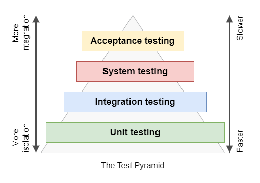

# Основы тестирования

📚 Содержание:

* [О пирамиде тестирования](#о-пирамиде-тестирования)
* [О способах тестирования](#о-способах-тестирования)
* [Об инструментах для тестирования](#об-инструментах-для-тестирования)
* [О подмене области рендеринга](#о-подмене-области-рендеринга)
* [О структуре теста](#о-структуре-теста)
* [Об Arrange, Act, Assert в Unit-тестировании](#об-arrange-act-assert-в-unit-тестировании)

🚧 Данный раздел находится в процессе разработки..

Тестирование - это процесс проверки функциональности, надежности и качества приложений. Оно выполняется с целью
обнаружения ошибок, повышения устойчивости приложений и обеспечения их правильной работы.

## О пирамиде тестирования

Одна из ключевых концепций, которую вам следует знать, это пирамида тестирования.

Существует несколько популярных подходов к организации пирамиды тестирования. Одна из самых распространенных моделей
называется пирамидой тестирования Майкла Коуна (Michael Cohn), он предложил эту концепцию в своей книге «Succeeding With
Agile. Software Development Using Scrum». Вот основные компоненты этой пирамиды, расположенные в порядке от самых нижних
к самым высоким:



- Unit (Module) Testing (Модульное тестирование): На нижнем уровне пирамиды находятся модульные тесты, которые проверяют
  отдельные модули программы или компоненты на соответствие заданным спецификациям.
- Integration Testing (Интеграционное тестирование): Следующий уровень включает тесты, которые проверяют взаимодействие
  между различными модулями или компонентами системы, чтобы убедиться, что они работают вместе правильно.
- System Testing (Системное тестирование): На этом уровне проверяется система в целом, чтобы убедиться, что все
  компоненты
  работают должным образом и взаимодействуют друг с другом.
- Acceptance Testing (Приемочное тестирование): На вершине пирамиды находится приемочное тестирование, которое
  выполняется
  пользователем или клиентом, чтобы убедиться, что система удовлетворяет их требованиям и ожиданиям.

В дополнение к пирамиде Майкла Коуна, существуют и другие модели организации пирамиды тестирования, такие как пирамида "
латте" и "мартини". В этих моделях уровни тестирования располагаются по-другому, но основной принцип остается тот же -
более ранние уровни фокусируются на проверке отдельных компонентов и их взаимодействия, а более высокие уровни тестируют
систему в целом или ее пользовательский интерфейс.

[⬆ Back to Top](#основы-тестирования)

## О способах тестирования

Тестирование React-приложений аналогично тестированию любого другого JavaScript-кода.

Есть несколько способов тестирования React-приложений. В целом, можно выделить два основных:

- Модульное тестирование (Unit Testing) - рендеринг деревьев компонентов в упрощенной тестовой среде и проверка их
  предполагаемого вывода. Модульные тесты применяются для обнаружения ошибок и проверки ожидаемого поведения компонентов
  при различных входных данных.
- Сквозное тестирование (End-to-end, E2E, Chain testing) - запуск всего приложения в реалистичной среде браузера (так
  называемые «сквозные» тесты). End-to-end тестирование относится к процессу проверки полного потока функциональности
  вашего веб-приложения от начала до конца. Это означает имитацию действий, которые реальный пользователь мог бы
  предпринять при взаимодействии с вашим приложением.

[⬆ Back to Top](#основы-тестирования)

## Об инструментах для тестирования

Среда тестирования для React обычно состоит из нескольких частей или наборов библиотек, которые совместно позволяют
создавать и запускать тесты для приложений на React. Основными компонентами такой среды могут быть:

- Test Framework: Тестовые фреймворки представляют собой набор инструментов и правил, которые помогают в
  структурировании и организации тестового кода. Они предоставляют функциональность для создания тестовых сценариев,
  выполнения проверок и утверждений, а также упрощают процесс запуска и анализа результатов тестирования. Некоторые
  популярные тестовые фреймворки для React включают Jest, Vitest, и Mocha.
- Test Runner: Исполнители тестов представляют собой средства, позволяющие запускать тестовые сценарии и анализировать
  их результаты. Они выполняют код тестовых сценариев в изолированной среде и предоставляют отчеты о пройденных или
  неудачных проверках. Например, Jest/Vitest являются и тестовым фреймворком, и исполнителем тестов.
- Utilities: Утилиты тестирования - это набор инструментов и функций, предназначенных для облегчения процесса
  написания и выполнения тестов. Они могут предлагать различные вспомогательные функции для манипуляции с
  React-компонентами, создания имитаций или заглушек для внешних зависимостей и т. д. Например, React Testing Library
  предоставляет утилиты для поиска и взаимодействия с элементами интерфейса React в тестовых сценариях.

Разница между исполнителем тестов и тестовым фреймворком заключается в их функциональности и уровне абстракции. Тестовый
фреймворк предоставляет общий набор инструментов и правил для написания и организации тестового кода. Он определяет
структуру и способ запуска тестовых сценариев, а также предоставляет основные возможности для написания утверждений и
проверок.

Исполнитель тестов, с другой стороны, является средством для выполнения тестового кода. Он берет на себя обязанность
запуска тестовых сценариев, организует их выполнение, обрабатывает результаты и предоставляет отчеты. Обычно исполнители
тестов работают внутри тестового фреймворка и используют его функциональность для выполнения кода тестовых сценариев.

Для тестирования React-приложений существует довольно приличное количество инструментов, вот некоторые из них:

- [Jest](https://jestjs.io/) (test runner & framework) - это JavaScript-фреймворк для тестирования JavaScript с акцентом
  на простоту. Работает с проектами, использующими Babel, TypeScript, Node, React, Angular, Vue и многое другое!
- [Vitest](https://vitest.dev/) (test runner & framework) - это JavaScript-фреймворк для модульного тестирования на базе
  Vite с поддержкой ESM, TypeScript и JSX на базе esbuild. Vitest совместим с Jest API и поддерживает интеграцию с
  большинством Jest API совместимых библиотек.
- [Mocha](https://mochajs.org/) (test runner & framework) - это JavaScript-фреймворк для программ на основе Node.js,
  может использоваться для тестирования React-компонентов. Mocha обладает мощной системой утверждений и позволяет
  использовать разные стили написания тестов, такие как BDD (Behavior-Driven Development) или TDD (Test-Driven
  Development).
- [Chai](https://www.chaijs.com/) - это библиотека для тестирования на JavaScript, которая работает с Node.js и
  браузером. Chai представляет собой BDD / TDD утверждение (assertion) библиотеку для node и браузера, которая может
  быть обстоятельно совмещена с любым javascript тестовым фреймворком. Эта библиотека часто применяется в тестировании в
  связке с Mocha и Enzyme, также может использоваться с Jest и Enzyme.
- [Enzyme](https://enzymejs.github.io/enzyme/) (utility for React) - это библиотека, разработанная Airbnb для
  тестирования React-компонентов. Она предоставляет удобные методы для манипуляции и проверки компонентов в тестах.
  Enzyme также хорошо интегрируется с Jest, Mocha, Vitest и другими популярными библиотеками и фреймворками.
- [React Testing Library (RTL)](https://testing-library.com/docs/react-testing-library/intro/) - это легковесная
  библиотека, специально разработанная для тестирования React-компонентов, является частью семейства библиотек (
  пакетов) [Testing Library](https://testing-library.com/). Она сосредотачивается на проверке компонентов
  с точки зрения пользователя, что помогает создавать более реалистичные и устойчивые тесты.
- [Cypress](https://www.cypress.io/) (test runner & framework) - это фреймворк для сквозного тестирования (End-to-end,
  E2E), интуитивный и мощный инструмент для автоматического тестирования веб-приложений, включая React-приложения. Он
  обладает функциями, которые позволяют вам напрямую взаимодействовать с приложением и выполнять проверки в режиме
  реального времени.
- [Storybook](https://storybook.js.org/) - это инструмент разработки компонентов, который также может использоваться для
  создания документации и написания тестов для ваших компонентов React. Вы можете создавать истории (stories), которые
  описывают различные состояния и варианты взаимодействия с компонентами, а затем тестировать их.

[⬆ Back to Top](#основы-тестирования)

## О подмене области рендеринга

Тестирование React-приложений запускается в среде, у которой нет доступа к реальной области рендеринга, например
такой как браузер. Для имитации работы браузера используются дополнительные библиотеки,
например [jsdom](https://github.com/jsdom/jsdom) или [happy-dom](https://github.com/capricorn86/happy-dom).

[jsdom](https://github.com/jsdom/jsdom) или [happy-dom](https://github.com/capricorn86/happy-dom) эмулируют среду
браузера в Node.js и позволяет вам работать с DOM (Document Object Model), то есть выполнять манипуляции с HTML и
исполнять JavaScript точно так же как вы бы делали это в реальном браузере.

Эти библиотеки устанавливаются в дополнение к фреймворкам и являются частью конфигурации **Test Environment**, например
в jest или Vitest.

[⬆ Back to Top](#основы-тестирования)

## О структуре теста

В JavaScript тест обычно означает набор инструкций, который выполняет некоторые проверки или проверяет работу
определенного кода или функциональности. Файл теста, с другой стороны, это файл, который содержит набор этих тестовых
инструкций.

Возьмем функцию `sum()`, которая возвращает сумму двух чисел:

```js
// sum.js
export const sum = (a, b) => a + b;
```

Файл с тестовым сценарием, как правило, именуется по названию модуля, для которого предназначен тест и располагается в
той же директории, что и сам модуль.
Имя файла с тестом, согласно соглашению об именах, включает в себя суффикс `test` или `spec` (Jasmine convention),
например: `sum.test.js` или `sum.spec.js`.

Напишем тест для этой функции с использованием [Vitest](https://vitest.dev/guide/):

```js
// sum.test.js
import { describe, expect, test } from 'vitest';

import { sum } from './sum.js';

describe('sum', () => {
  test('should correctly sum two numbers', () => {
    const expected = 3;
    const result = sum(1, 2);
    expect(result).toBe(expected);
  });
});
```

или

```js
// sum.test.js
import { describe, expect, it } from 'vitest';

import { sum } from './sum.js';

describe('sum', () => {
  it('should correctly sum two numbers', () => {
    const expected = 3;
    const result = sum(1, 2);
    expect(result).toBe(expected);
  });
});
```

**describe()** - используется для группировки связанных тестовых блоков или тестовых кейсов. Эта функция позволяет
создавать иерархическую структуру тестов, что делает код тестов более организованным и понятным. Функция `describe()`
принимает два аргумента: строку с описанием тестового блока и функцию обратного вызова, которая содержит сами тесты.

**test()** - используется для определения и запуска тестовых случаев (test cases), она принимает два аргумента: строку,
представляющую название тестового случая, и функцию с телом теста.

**it()** - это псевдоним для функции `test()`, она работает точно так же, поэтому это только вопрос выбора, используете
ли вы `it()` или `test()`.

**expect()** - используется каждый раз, когда требуется проверить определенный результат, и она принимает один аргумент,
представляющий значение, которое создает ваш код. В большинстве случаев `expect()` используется с функцией
сопоставления, чтобы проверять, соответствует ли полученное значение определенным ожиданиям.

Например, этот код утверждает, что значение `input` равно 2. Если это не так, утверждение выдаст ошибку, и тест
завершится неудачей:

```js
import { expect } from 'vitest'

const input = Math.sqrt(4)

expect(input).to.equal(2) // chai API
expect(input).toBe(2) // jest API
```

**toBe()** - это функция сопоставления (matcher function), которая позволяет сопоставить утверждение с
ожидаемым значением. Существует множество различных функций сопоставления, которые предоставляются фреймворками или
дополнительными библиотеками.

[⬆ Back to Top](#основы-тестирования)

## Об Arrange, Act, Assert в Unit-тестировании

AAA (Arrange, Act, Assert) - это шаблон или подход для структурирования кода тестов на уровне единицы, они представляют
собой фазы, которые должен следовать хорошо структурированный тест.

```js
test('should correctly sum two numbers', () => {
  /* Arrange */
  const expected = 3;

  /* Act */
  const result = sum(1, 2);

  /* Assert */
  expect(result).toBe(expected);
});
```

⚡ **Arrange** - В этой фазе создаются все необходимые объекты, настраивается окружение и подготавливается тестируемый
код для выполнения. В Vitest для этого часто используется функция `beforeEach()`, которая выполняется перед каждым
тестом, или `beforeAll()`, которая выполняется один раз перед запуском всех тестов.

⚡ **Act** - В этой фазе вы запускаете функционал, который хотите протестировать. Включает вызов метода или функции,
которую проверяет тест.

⚡ **Assert** - Это фаза в которой проверяется утверждение, может состоять из нескольких утверждений. Однако если они
разноплановые, то стоит задуматься о дизайне тестируемого компонента, или возможно разбить большой тест, на более
мелкие.

### Некоторые распространенные ошибки при использовании AAA:

- **Нарушение порядка AAA**. AAA (Arrange, Act, Assert) предполагает четкий порядок выполнения шагов Arrange, Act и
  Assert.
  Нарушение этого порядка может усложнить понимание и отладку теста.
- **Несколько фаз в одном тесте, более чем три описанных как AAA**. Один тест должен три фазы, то есть по одной фазе из
  AAA.
- **Условия и циклы в тестах**. Тест должен быть в виде простой последовательности шагов без использования ветвлений и
  циклов.
- **Фаза Assert содержит множественные утверждения**. Лучше иметь четкое утверждение для каждого тестового случая, это
  упрощает отладку и понимание причины сбоя теста.
- **Фаза Act из нескольких строк**. Это может нарушать логическую целостность, если эти строки являются связанными и
  должны
  выполняться атомарно. Для решения проблемы нарушения логической целостности, связанной с фазой Act, можно использовать
  инкапсуляцию (упаковать соответствующие команды или инструкции в одну функцию или метод, которая будет вызываться как
  единое действие).
- **Недостаточная изоляция**. Каждый тест должен быть полностью изолирован от остальных тестов и от внешних
  зависимостей.
  Нарушение изоляции может привести к нестабильным и непредсказуемым результатам тестов.
- **Позитивные и негативные сценарии в одном тесте**. Следует разделять позитивные и негативные сценарии на отдельные
  тесты,
  это помогает улучшить читаемость и понятность кода, упрощает отладку и обеспечивает ясность в ожидаемых результатах

[⬆ Back to Top](#основы-тестирования)

## О покрытии кода - Code coverage

Code coverage (покрытие кода) — это процент кода, покрытый тестами.

В большинстве случаев, когда говорят о покрытии кода, имеют в виду Unit-тестирование (модульное тестирование).

### Типы покрытия кода

- **Statement coverage** (покрытие операторов) - каждый оператор должен быть выполнен хотя бы один раз. Показатель
  покрытия
  операторов: `(Количество выполненных операторов / Общее количество операторов) * 100`.
- **Branch coverage** (покрытие ветвей) - оценка степени выполнения различных ветвей кода в программе, возникающий в
  результате выполнения условных операторов, циклов и операторов переключения (типа switch). Показатель
  покрытия: `(Количество выполненных ветвей / Общее количество ветвей)* 100`
- **function coverage** (покрытие функций) - каждая функция должна быть вызвана хотя бы один раз, также могут
  проверяться
  параметры функций, с которыми они вызываются. Показатель
  покрытия: `(Количество выполненных функций / Общее количество функций)* 100`

### Процент покрытия кода

Общепринятая рекомендация состоит в достижении 70-80% при Unit-тестировании, и 90% и выше при интеграционном
тестировании.

Важно также понимать, что покрытие кода не является исчерпывающим мерилом качества тестирования. Наличие высокого
процента покрытия кода не гарантирует отсутствие ошибок или полную проверку всех возможных сценариев. Идеальный
показатель в тестировании программы состоит в обнаружении максимального количества дефектов при полном охвате
функциональности программы.

### Инструменты оценки покрытия кода

- **[Istanbul](https://istanbul.js.org/)** - это инструмент для контроля покрытия кода в JavaScript. Istanbul
  анализирует ваш JavaScript код (
  включая ES5 и ES2015+), выполняет его, отслеживает какие строки, ветви и функции были выполнены, а потом формирует
  подробный отчет об этих данных. Этот отчет можно просмотреть в нескольких форматах, включая html и текст, и он может
  быть интегрирован с другими инструментами CI/CD для автоматического контроля покрытия кода.
- **[c8](https://github.com/bcoe/c8)** - это инструмент для контроля покрытия кода с использованием встроенной
  функциональности Node.js, совместимой с репортерами **Istanbul**. c8 стал
  заменой [v8-coverage](https://www.npmjs.com/package/v8-coverage).
- **[Сервис Codecov](https://about.codecov.io/)** - это комплексное решение для создания отчетов о покрытии кода для
  любого набора тестов, может быть легко интегрирован с популярными системами непрерывной интеграции (CI) и непрерывного
  развертывания (CD), такими как Jenkins, Travis CI, CircleCI, GitHub Actions и другими, легко интегрируется с
  популярными хостинг-платформами, такими как GitHub, Bitbucket и GitLab.

Эти инструменты могут используются совместно с
фреймворками [Vitest](https://vitest.dev/guide/coverage.html), [Jest](https://jestjs.io/docs/cli#--coverageboolean),
Mocha, Jasmine и тд., поддерживают генерацию отчетов о покрытии кода в различных форматах, таких как HTML, текстовые и
Cobertura.

[⬆ Back to Top](#основы-тестирования)

Документация по теме:

- 🔗 [The Testing Pyramid: How to Structure Your Test Suite](https://semaphoreci.com/blog/testing-pyramid)

[⬆ Back to Top](#основы-тестирования)
