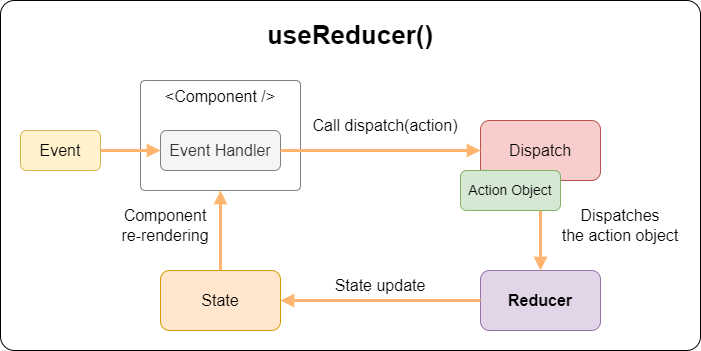

# Знакомство с хуком useReducer

📚 Содержание

- [Что не так с "Todo App" и useState()](#что-не-так-с-todo-app-и-usestate)
- [useReducer() - еще один способ управления состоянием компонента](#usereducer---еще-один-способ-управления-состоянием-компонента)
- [Рефакторинг приложения "Todo App"](#рефакторинг-приложения-todo-app)
- [Константы и генераторы экшенов (Action Creators)](#константы-и-генераторы-экшенов-action-creators)
- [Применение useReducer()](#применение-usereducer)

### Что не так с "Todo App" и useState()

Давайте посмотрим на реализацию приложения "Todo App"
из [chapter-09](https://github.com/shopot/react-101/blob/chapter-09/src/app/app.tsx), где для хранения списка Todo
использовалась переменная состояния с из хука `useState()`:

```jsx
const initialState = [
  // ...
];

const App = () => {
  const [todos, setTodos] = useState(initialState);

  const handleToggleTodo = (todoId) => {
    const newTodos = todos.map((t) => {
      if (t.id === todoId) {
        return {...t, completed: !t.completed};
      }

      return t;
    });

    setTodos(newTodos);
  };

  const handleRemoveTodo = (todoId) => {
    const newTodos = todos.filter(({id}) => id !== todoId);

    setTodos(newTodos);
  };

  const handleAddTodo = (title) => {

    const id = uuidv4();
    
    const newTodos = [...todos, {id, title, completed: false}];

    setTodos(newTodos);
  };

  return (
    <>
      <h1>Todo App</h1>
      <AddTodoForm onAddTodo={handleAddTodo} />
      <TodoList
        todos={todos}
        onToggleComplete={handleToggleTodo}
        onRemove={handleRemoveTodo}
      />
    </>
  );
};
```

Как видно из примера, помимо самой переменной состояния, которая содержит список Todo, компонент содержит логику
управления списком Todo.

Хук `useState()` предоставляет одну переменную состояния, которая содержит сложную структуру данных в виде массива
объектов и всего один метод для изменения этой переменной, вся остальная логика, связанная с изменением данных внутри
списка, реализована внутри самого компонента.

Такая реализация имеет ряд недостатков, а именно:

- Компонент выполняет несколько не связанных между собой задач: управление логикой состояния и управление логикой
  рендеринга;
- Компонент имеет множество обновлений состояния, распределенных по разным обработчикам событий;
- Размер компонента увеличивается за счет кода, который напрямую не связан с логикой рендеринга;
- Дизайн компонента, с точки зрения кода усложняется;

В результате такую реализацию будет сложно читать, поддерживать и тестировать.

[⬆ Back to Top](#знакомство-с-хуком-usereducer)

### useReducer() - еще один способ управления состоянием компонента

**useReducer()** - это еще один способ управления состоянием компонента в React, который позволяет иметь
более сложную логику управления состоянием, чем простое использование `useState()`.

Хук `useReducer() `принимает два аргумента: функцию редюсер `reducer()` и начальное состояние.
Затем хук возвращает массив из двух сущностей: текущее состояние и функцию отправки - `dispatch`.

```jsx
import { useReducer } from 'react';

const reducer = (state, action) => {
  // ...
};

const initialState = {
  age: 25,
};

const MyComponent = () => {
  const [state, dispatch] = useReducer(reducer, initialState);
  // ...
};
```

💡 Reducer - это обычная функция, которая принимает два параметра: `текущее состояние приложения`
и `экшен, который необходимо выполнить`, и возвращает новое состояние.

То есть редюсер это функция, которая описывает некую логику для изменения состояния, принимая состояние и экшен в
качестве аргументов и в качестве результата возвращает следующее состояние.

💡 Редюсеры это чистые функции, это значит у них нет побочных эффектов. Они возвращают одно и то же значение, если задать
одни и те же аргументы.

В отличие от хука `useState()`, вызывая хук  `useReducer()`, первым аргументом вы передаете функцию, которая будет
управлять переменной состояния, а вторым аргументом передается начальное значение для этой переменной, в ответ на вызов вы
получите текущее значение переменной состояния и функцию отправки **dispatch**.

Для того что бы изменить переменную состояния в случае с использованием `useReducer()`, нужно вызвать функцию
отправки **dispatch** и передать в нее экшен (action), то есть простыми словами, указать что необходимо выполнить с
текущим состоянием.

По соглашению, экшен (action) обычно представляет собой объект со свойством `type`, идентифицирующим сам экшен.
Так же этот объект при необходимости может содержать и другие свойства с дополнительной информацией необходимой для
изменения состояния.

```jsx
const [state, dispatch] = useReducer(reducer, {age: 42});

const handleClick = () => {
  dispatch({type: 'increment_age'});
  // ...
};
```

В результате вызова функции `dispatch({type: 'increment_age'})`, функция `reducer()` получит `action` в виде
объекта `{type: 'increment_age'}`, выполнит необходимые действия над текущем значением состояния и вернет следующее
состояние.

Функция `reducer()` должна иметь представление о передаваемом экшене (action):

```jsx
const reducer = (state, action) => {
  switch (action.type) {
    case 'increment_age': {
      return {
        age: state.age + 1
      };
    }
  }

  throw new Error('Unknown action.');
};
```

Здесь функция `reducer()` принимает текущее состояние в виде аргумента `state` и экшен в виде аргумента `action`, и
если будет найдено соответствие для `action.type`, то функция `reducer()` вернет значение следующего состояния. Далее
React обновит состояние компонента до нового значения, и запустит повторный рендеринг.

💡 Функция отправки `dispatch`, возвращаемая хуком `useReducer()`, позволяет обновить состояние и запускает повторный
рендеринг.

Как работает обновление состояния с помощью `useReducer()`:



1. Функция отправки с объектом экшен (action) вызывается в результате обработчика событий или выполнения запроса.
2. Затем React перенаправляет объект экшен (action)  и значение текущего состояния в функцию редюсер.
3. Функция редюсер использует объект экшен и выполняет обновление состояния, возвращая следующее состояние.
4. Затем React сравнивает два состояния, текущее состояние и то, которое вернула функция редюсер. Если состояния
   отличаются, то React запускает повторный рендеринг компонента, а `useReducer()` возвращает уже обновленное значение
   состояния.

Полный пример с `useReducer()` будет выглядеть следующим образом:

```jsx
import { useReducer } from 'react';

const reducer = (state, action) => {
  switch (action.type) {
    case 'increment_age': {
      return {
        age: state.age + 1
      };
    }
  }

  throw new Error('Unknown action.');
};

const initialState = {
  age: 25,
};

const MyComponent = () => {
  const [state, dispatch] = useReducer(reducer, initialState);

  const handleClick = () => {
    dispatch({type: 'increment_age'});
  };

  return (
    <>
      <h2>Current age is {state.age}</h2>
      <button onClick={handleClick}>Increment age</button>
    </>
  );
};
```

[⬆ Back to Top](#знакомство-с-хуком-usereducer)

### Рефакторинг приложения "Todo App"

> Рефакторинг (refactoring) - это процесс изменения внутренней структуры исходного кода программы без изменения её
> внешнего поведения. Целью рефакторинга является улучшение качества программного кода - увеличение его читаемости,
> понятности, гибкости, расширяемости, нацеленное на дальнейшее сокращение времени разработки и поддержки программы.

Проведем небольшой рефакторинг приложения "Todo App", заменим хук `useState()` на хук `useReducer()`.

Первым делом нужно создать функцию `todoReducer()` (редюсер для хука `useReducer()`) и вынести в нее всю логику
связанную с изменением списка Todo:

```jsx
// src/reducers/todo/reducer.js
export const todoReducer = (state, action) => {
  const {type, todoId, title} = action;

  switch (type) {
    case 'add_new_todo': {
      if (!title) {
        break;
      }

      const id = uuidv4();
      
      return [...state, {id: todoId, title, completed: false}];
    }

    case 'remove_todo': {
      return state.filter(({id}) => id !== todoId);
    }

    case 'toggle_completed': {
      return state.map((t) => {
        if (t.id === todoId) {
          return {...t, completed: !t.completed};
        }

        return t;
      });
    }
  }

  // Return unchanged state
  return structuredClone(state);
};
```

По соглашению, код который вычисляет следующее состояние, обычно записывают в виде инструкции `switch`.
Для каждого блока `case` в инструкции `switch` будет вычисляться и возвращаться следующее состояние.

❗ Если `todoReducer()` получит экшен (action) которого нет в инструкции `switch` или какие-то данные будут
отсутствовать,
то `todoReducer()` вернет неизмененное состояние. На практике такое поведение не является типичным, правильнее будет
сгенерировать исключение с соответствующим сообщением об ошибке, это позволит избежать побочных эффектов и обнаружить
ошибки в реализации логики в работе с редюсером.

Теперь компонент `<App />` будет выглядеть следующим образом:

```jsx
import { ReactElement, useReducer } from 'react';

import { TodoList } from '@/components/todo-list';
import { AddTodoForm } from '@/components/add-todo-form';
import { todoReducer } from '@/reducers/todo';

const App = () => {
  const [todos, dispatch] = useReducer(todoReducer, []);

  const handleAddTodo = (title) => dispatch({type: 'add_new_todo', title});

  const handleRemoveTodo = (todoId) => dispatch({type: 'remove_todo', todoId});

  const handleToggleTodo = (todoId) => dispatch({type: 'toggle_completed', todoId});

  return (
    <>
      <h1>Todo App</h1>
      <AddTodoForm onAddTodo={handleAddTodo} />
      <TodoList
        todos={todos}
        onToggleComplete={handleToggleTodo}
        onRemove={handleRemoveTodo}
      />
    </>
  );
};
```

Итоги рефакторинга:

- У нас есть отдельная функция `todoReducer()`, которая содержит всю логику для работы со списком Todo, является чистой
  функцией и вынесена в отдельный файл (модуль).
- Компонент `<App />` больше не содержит описание логики для управления состоянием, вместо этого он использует
  вызов функции `dispatch()` с передачей экшенов (action).

[⬆ Back to Top](#знакомство-с-хуком-usereducer)

### Константы и генераторы экшенов (Action Creators)

Если посмотреть на реализацию и использование `action` для приложения "Todo App", то можно увидеть, что в двух
местах используются явно заданные (hardcoded) повторяющиеся значения типа `add_new_todo`,  `remove_todo`
и `toggle_completed` эти значения можно заменить на строковые константы.

Определение типа `action` в виде констант является наследием архитектуры **Flux**, во **Flux** традиционно считается,
что
вы должны определять каждый тип `action` строковой константой, сам список констант обычно выносится в отдельный модуль:

```js
// src/reducers/todo/actions.ts
export const ADD_NEW_TODO = 'ADD_NEW_TODO';

export const REMOVE_TODO = 'REMOVE_TODO';

export const TOGGLE_COMPLETED = 'TOGGLE_COMPLETED';
```

Чем это выгодно? Часто утверждают, что константы не нужны, и для маленьких проектов это может быть действительно так. Для
больших проектов, существует несколько преимуществ определение типов экшенов через константы:

- Это помогает держать наименование последовательным, потому что все типы экшенов собраны в одном месте.
- Иногда лучше видеть все существующие экшены перед началом работы над следующим функционалом. Может такое случиться,
  что нужный вам экшен уже добавлен кем-то из членов команды, но вы этого не знали.
- Список типов экшенов, которые уже были добавлены, удалены и изменены в Pull Request поможет каждому члену команды
  отслеживать объем и реализацию нового функционала.
- Если вы допустили опечатку при импорте константы, вы получите `undefined` и вы найдете ошибку быстрее.

Другое общепринятое соглашение - это вместо создания объектов экшенов в той же части приложения, где эти экшены
вызываются, заменить их на функции-генераторы.

Например, вместо вызова dispatch с агрументом-объектом:

```js
dispatch({
  type: 'ADD_NEW_TODO',
  title: 'Learn React.js'
});
```

Вы можете определить генератор экшенов в отдельном модуле:

```js
// src/reducers/todo/actions.js
export const addNewTodo = (title) => ({type: ADD_NEW_TODO, title});
```

И затем импортировать его для вызова в компонент:

```js
// src/app/app.jsx
import { addNewTodo } from '@/reducers/todo';

//...

const App = () => {
  //...
  const handleAddTodo = (title) => dispatch(addNewTodo(title));

  //...
}
```

> Генераторы экшенов часто подвергались критике за свою шаблонность. Что ж, Вы можете их не писать! Вы можете
> использовать объекты, если чувствуете, что это лучше подходит для Вашего проекта.

💡 Генераторы экшенов не являются обязательным к использованию, однако генераторы экшенов это еще один уровень
абстракции, который позволяет вам отделять дополнительную логику отправки экшенов от реального выбрасывания этих экшенов
компонентами.

Итоговый листинг с использованием генераторов будет следующим:

`actions.js`

```jsx
// src/reducers/todo/actions.js
export const ADD_NEW_TODO = 'ADD_NEW_TODO';
export const REMOVE_TODO = 'REMOVE_TODO';
export const TOGGLE_COMPLETED = 'TOGGLE_COMPLETED';

export const addNewTodo = (title) => ({type: ADD_NEW_TODO, title});

export const removeTodo = (todoId) => ({type: REMOVE_TODO, todoId});

export const toggleCompleted = (todoId) => ({type: TOGGLE_COMPLETED, todoId});
```

`reducer.js`

```jsx
// src/reducers/todo/reducer.js
import { v4 as uuidv4 } from 'uuid';

import { ADD_NEW_TODO, REMOVE_TODO, TOGGLE_COMPLETED } from './actions';

export const todoReducer = (state, action) => {
  const {type, todoId, title} = action;

  switch (type) {
    case ADD_NEW_TODO: {
      if (!title) {
        break;
      }

      const id = uuidv4();

      return [...state, {id, completed: false}];
    }

    case REMOVE_TODO: {
      return state.filter(({id}) => id !== todoId);
    }

    case TOGGLE_COMPLETED: {
      return state.map((t) => {
        if (t.id === todoId) {
          return {...t, completed: !t.completed};
        }

        return t;
      });
    }
  }

  throw new Error('Unknown action: ' + action.type);
};
```

`app.jsx`

```jsx
// src/app/app.jsx
import { useReducer } from 'react';

import { TodoList } from '@/components/todo-list';
import { AddTodoForm } from '@/components/add-todo-form';
import { addNewTodo, removeTodo, toggleCompleted, todoReducer } from '@/reducers/todo';

const App = () => {
  const [todos, dispatch] = useReducer(todoReducer, []);

  const handleAddTodo = (title) => dispatch(addNewTodo(title));

  const handleRemoveTodo = (todoId) => dispatch(removeTodo(todoId));

  const handleToggleTodo = (todoId) => dispatch(toggleCompleted(todoId));

  return (
    <>
      <h1>Todo App</h1>
      <AddTodoForm onAddTodo={handleAddTodo} />
      <TodoList
        todos={todos}
        onToggleComplete={handleToggleTodo}
        onRemove={handleRemoveTodo}
      />
    </>
  );
};
```

[⬆ Back to Top](#знакомство-с-хуком-usereducer)

### Применение useReducer()

💡 Как и все React хуки, `useReducer()` вызывается только на верхнем уровне вашего компонента.

💡 `useReducer()` возвращает массив ровно с двумя элементами:

1. Текущее значение переменной состояния, первоначально установленное при вызове `useReducer()`.
2. Функция отправки, которая вызывается для того что бы изменить текущее состояние.

💡 Чтобы обновить то, что отображается на экране, вызовите `dispatch()` с объектом экшен (action). По соглашению экшен
это объект, который содержит свойство `type`, которое идентифицирует этот экшен:

```jsx
const handleClick = () => {
  dispatch({type: 'increment_age'});
};
```

React передаст текущее состояние и объект экшен в вашу функцию редюсер. Ваш редюсер рассчитает и вернет следующее
состояние. React сохранит это следующее состояние, запустит повторный рендеринг компонента и обновит пользовательский
интерфейс.

💡 Состояние (аргумент функции редюсера) доступно только для чтения. Не изменяйте никакие объекты или массивы в
состоянии:

```jsx
const reducer = (state, action) => {
  switch (action.type) {
    case 'increment_age': {
      // ❌ Don't mutate an object in state like this:
      state.age = state.age + 1;
      return state;
    }
    //...
  }
  //...
};
```

Вместо этого всегда возвращайте новые объекты из вашего редюсера:

```jsx
const reducer = (state, action) => {
  switch (action.type) {
    case 'increment_age': {
      // ✅ Instead, return a new object
      return {
        ...state,
        age: state.age + 1,
      };
    }
    //...
  }
  //...
}
```

💡 Вызов функции `dispatch()` не меняет состояние работающего кода.

```jsx
const handleClick = () => {
  console.log(state.age);  // 42

  dispatch({type: 'increment_age'}); // Request a re-render with 43
  console.log(state.age);  // Still 42!

  setTimeout(() => {
    console.log(state.age); // Also 42!
  }, 5000);
};
```

Это потому, что состояния ведут себя как snapshot. Обновление состояния требует повторного рендеринга компонента с новым
значением состояния, но не влияет на переменную состояния JavaScript в уже запущенном обработчике событий.

💡 React проигнорирует ваше обновление, если следующее состояние будет равно предыдущему, как это определено сравнением
`Object.is()`. Обычно это происходит, когда вы напрямую меняете объект или массив в состоянии:

```jsx
const reducer = (state, action) => {
  switch (action.type) {
    case 'increment_age': {
      // ❌ Wrong: mutating existing object
      state.age++;
      return state;
    }
    case 'changed_name': {
      // ❌ Wrong: mutating existing object
      state.name = action.nextName;
      return state;
    }
    // ...
  }
}
```

Вы изменили существующий объект состояния и вернули его, поэтому React проигнорировал обновление. Чтобы это исправить,
вам необходимо убедиться, что вы всегда обновляете объекты в состоянии и обновляете массивы в состоянии, а не изменяете
их:

```jsx
const reducer = (state, action) => {
  switch (action.type) {
    case 'increment_age': {
      // ✅ Correct: creating a new object
      return {
        ...state,
        age: state.age + 1,
      };
    }
    case 'changed_name': {
      // ✅ Correct: creating a new object
      return {
        ...state,
        name: action.nextName,
      };
    }
    // ...
  }
};
```

💡 Не забывайте вернуть новое состояние в каждом блоке `case` в инструкции `switch` вашего редюсера:

```jsx
const reducer = (state, action) => {
  switch (action.type) {
    case 'increment_age': {
      // ...
    }
    case 'edit_name': {
      // ...
    }
  }

  throw new Error('Unknown action: ' + action.type);
};
```

💡 В строгом режиме (Strict Mode) React дважды вызовет функции reducer и initializer. Это не должно нарушить работу
вашего кода.

🔗 [Ссылка на деплой приложения](https://todo-app-ab1e50.netlify.app/)

Готовый пример с приложением находится в `src`.

Для запуска примера с готовым приложением выполните команды:

```shell
git clone https://github.com/shopot/react-101.git

git checkout hook-use-reducer

npm install

npm run dev
```

Документация по теме:

- 🔗 [React Hook useReducer()](https://react.dev/reference/react/useReducer)
- 🔗 [Extracting State Logic into a Reducer](https://react.dev/learn/extracting-state-logic-into-a-reducer)
- 🔗 [Updating Objects in State](https://react.dev/learn/updating-objects-in-state)
- 🔗 [Updating Arrays in State](https://react.dev/learn/updating-arrays-in-state)
- 🔗 [State as a Snapshot](https://react.dev/learn/state-as-a-snapshot)
- 🔗 [Strict Mode](https://react.dev/reference/react/StrictMode)
- 🔗 [Keeping Components Pure](https://react.dev/learn/keeping-components-pure)

[⬆ Back to Top](#знакомство-с-хуком-usereducer)
