# Путеводитель по Flux в картинках

Обзор сделан по путеводителю по Flux от Лин Кларк (Lin
Clark): [A cartoon guide to Flux](https://code-cartoons.com/articles/a-cartoon-guide-to-flux/)

📚 Содержание:

- [Проблема](#проблема)
- [Решение: однонаправленный поток данных](#решение-однонаправленный-поток-данных)
- [Представление "персонажей" в системе Flux](#представление-персонажей-в-системе-flux)
  - [The action creator](#the-action-creator---генератор-экшенов)
  - [The dispatcher](#the-dispatcher---диспетчер)
  - [The store](#the-store---хранилище-состояние-приложения)
  - [The controller view and The view](#the-controller-view-and-the-view---контроллер-представления-и-представление)
- [Как они работают вместе](#как-они-работают-вместе)
  - [The setup - Настройка](#the-setup---настройка)
  - [The data flow - Поток данных](#the-data-flow---поток-данных)

## Проблема

Flux, как и React, появилась в Facebook (Meta).
Flux это схема обработки данных или, как принято назвать, архитектурный шаблон, Он был разработан для решения
ряда проблем, с которыми столкнулся Facebook.

Одним из хорошо известных примеров подобных проблем был баг уведомлений, Facebook имел затруднения с управлением
уведомлениями. Это было вызвано тем, что изменение состояния в одном компоненте могло привести к вызову уведомлений в
других местах приложения, что усложняло отладку и былое менее предсказуемо.

Основной выявленной проблемой оказался "путь", по которому "шел" поток данных в приложении.

В упрощенном виде это были модели, которые хранили данные и отправляли их на уровень представления для последующего
рендеренга (здесь описываются части архитектурного шаблона MVC - Model View Controller).

> Лин Кларк: "Это то, что я почерпнул из упрощенных версий, которыми они поделились на переговорах. Я уверен, что
> реальная архитектура выглядела иначе".

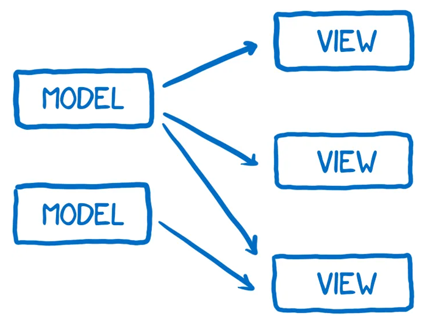

Поскольку взаимодействие с пользователем происходило через представления, представлениям иногда приходилось обновлять
модели на основе пользовательского ввода.

А иногда моделям требовалось обновить другие модели.

Кроме того, иногда подобные действия запускали каскад других изменений в моделях и представлениях.

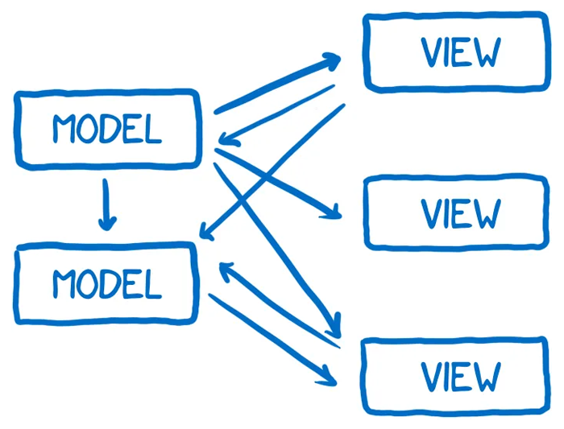

Добавьте к этому тот факт, что эти изменения могут происходить асинхронно (asynchronously) и одно изменение может
вызвать множество других изменений, это как бросание полного мешка мячиков для пинг-понга в игру, когда они разлетаются
во всех направлениях с пересекающимися траекториями.

В конце концов, это усложняет отладку потока данных.

## Решение: однонаправленный поток данных

Было принято решение попробовать другую архитектуру, в которой данные "текут" в одном направлении - только одно
направление - и когда нужно вставить новые данные, поток начинает все с самого начала. Этот архитектурный шаблон получил
название **Flux**.

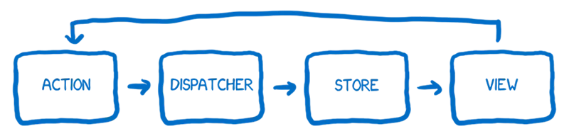

> Лин Кларк: "Что помогло мне лучше понять Flux, так это не такая диаграмма, а размышление о системе с точки зрения
> разных персонажей, работающих вместе как команда для достижения цели."

## Представление "персонажей" в системе Flux

Краткое представление персонажей, прежде чем будет объяснено, как они все взаимодействуют.

### The action creator - Генератор экшенов

Первый персонаж - генератор экшенов (здесь и далее экшен от слова action). Он отвечает за создание экшенов, то есть он
создает путь, по которому должны проходить все изменения и взаимодействия. Всякий раз, когда вы хотите изменить
состояние приложения или изменить отображение представления, вы запускаете экшен, которе создал `action creator`.

Подумайте об `action creator` как о телеграфисте. Вы обращаетесь к нему, зная, какое сообщение вы хотите
отправить, а телеграфист форматирует его так, чтобы его могла понять остальная часть системы.

`action creator` создает экшен с типом (`type`) и полезной нагрузкой (`payload`). Типом будет один из типов, которые вы
определили как экшены в вашей системе (обычно это список констант). Примером экшена может быть что-то
вроде `MESSAGE_CREATE` или `MESSAGE_READ` (в системе телеграфа).

Когда у вас есть часть программы, которая описывает создание всевозможных экшенов, вы будете иметь приятный побочный
эффект. Каждый новый разработчик, пришедший на проект, может открыть файл с определением генераторов экшенов и увидеть
весь API - все возможные изменения состояния - которые предоставляет ваша система.

Как только телеграфист отформатирует сообщение, оно будет передано телефонному оператору (The dispatcher).

### The dispatcher - Диспетчер

Диспетчер это большой реестр функций обратных вызовов. Он чем-то напоминает телефонного оператора, работающего с
коммутатором. Он хранит список всех хранилищ (stores), которым нужно отправлять экшены. Как только диспетчер получает
экшен, он отправляет его по разным хранилищам, это делается синхронно, что позволяет справиться последствиями эффекта
игры с несколькими мячиками в пинг-понг.

Диспетчер Flux отличается от диспетчеров во многих других архитектурах. Диспетчер отправляет экшен во все
зарегистрированные хранилища (stores) независимо от типа экшена. Это значит, что `store` не просто подписывается на
какие-то экшены, `store` "слышит" обо всех экшенах и сам принимает решение какие экшены относятся к нему, а какие нет.

### The store - Хранилище, состояние приложения

Следующий персонаж - это хранилище. Оно содержит все состояния приложения, а также всю логику для изменения этих
состояний.

Можно думать о хранилище как о чрезмерно контролирующем бюрократе. Все изменения состояний должны быть сделаны им
лично. И вы не можете напрямую запросить изменение состояния, хранилище не предусматривает аткой механизм. Чтобы
запросить изменение состояния, вы должны следовать надлежащей процедуре… вы должны отправить экшен через
конвейер `action creator -> dispatcher`.

Если хранилище зарегистрировано в диспетчере, все экшены через диспетчер будут отправляться ему. Внутри хранилища обычно
имеется оператор `switch`, который анализирует тип (`type`) эшена и решает, будут ли внесены изменения состояния на
основе этого экшена или нет.

Как только хранилище внесет изменения в состояние, оно вызовет событие изменения. Это уведомит представление контроллера
об изменении состояния (паттерн Observer).

### The controller view and The view - Контроллер представления и представление

Представление (View) в ответе за получение состояния и отображение его для пользователя так же, как и за принятие данных
от пользователя.

Представление является ведущим. Он ничего не знает о приложении, он просто знает, какие данные ему передаются, и как
выводить эти данные в понятном формате пользователям (через HTML).

Контроллер представления действует как менеджер среднего звена между хранилищем и представлением. Хранилище сообщает об
изменении состояния. Контроллер представления берет обновленное состояние, а затем отправляет его по всем связанным
представлениям.

## Как они работают вместе

Итак, давайте посмотрим, как все эти персонажи работают вместе.

### The setup - Настройка

Сначала необходима настройка: инициализация приложения, которая происходит один раз при старте приложения.

1. Хранилища сообщают диспетчеру, что они хотят получать уведомления при каждом поступлении какого-либо экшена.

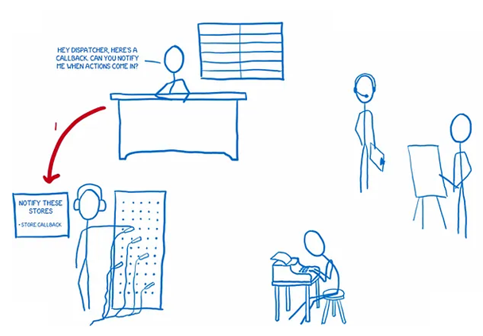

2. Затем контроллер запрашивает у хранилища последнее состояние.
3. После того, как хранилища передают состояние контроллеру, контроллер также передают его своим дочерним представлениям
   для отображения.

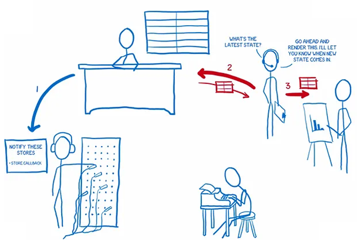

4. Контроллер просит хранилища держать его в курсе, когда состояние изменяется.

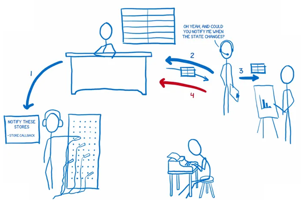

### The data flow - Поток данных

После завершения настройки приложение готово принимать вводимые пользователем данные. Теперь можно инициировать экшен,
попросив пользователя внести изменения.

Запустим поток данных на основе взаимодействия с пользователем. Пользователь: `Число посередине должно быть равным 10`

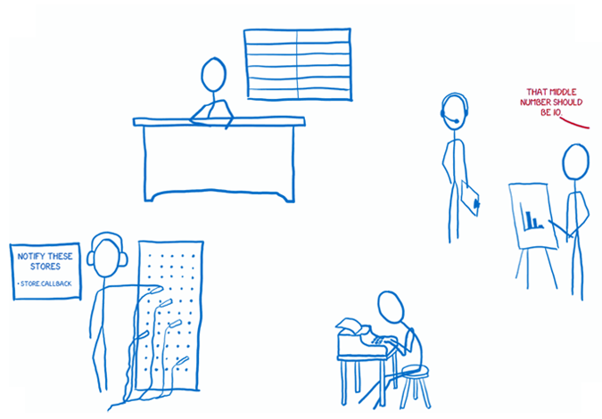

1. Представление говорит генератору экшенов приготовить его: `Не мог бы ты отправить экшен UPDATE_STATISTICS?
   Пусть число посередине будет равным 10`

2. Генератор экшенов "готовит" экшен и отправляет диспетчеру: `"Отправь этот экшен хранилищам, когда они будут
   готовы"`

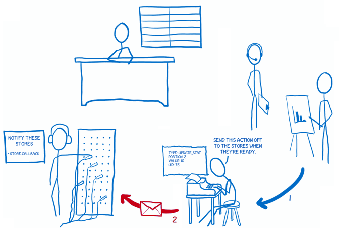

3. Диспетчер последовательно отправляет экшены хранилищам. Каждое хранилище получает уведомления обо всех экшенах.
   Затем хранилище определяет, нужно ли отреагировать на экшен или нет, и соответствующим образом меняет состояние.

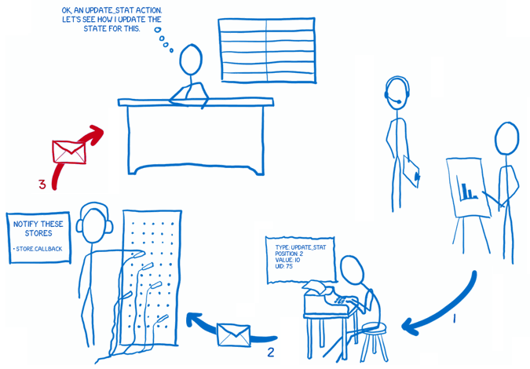

4. Как только состояние изменилось, хранилище дает об этом знать всем подписанным на него контроллерам.

5. Эти контроллеры затем получают от хранилища обновленное состояние. `Хранилище: "Произошло изменение состояния!".
   Контроллер: "О, круто, отправь его, пожалуйста"`

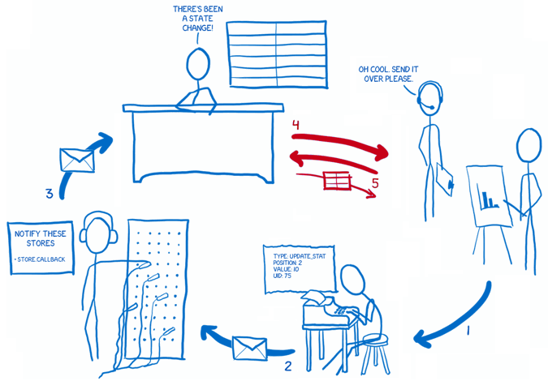

6. После того как хранилище отправит состояние контроллеру представления, тот сообщит своим дочерним представлениям о
   необходимости повторного рендеринга на основе нового состояния. `Контроллер: Они только что отдали мне обновленное
   состояние. Пора его повторно отобразить"`

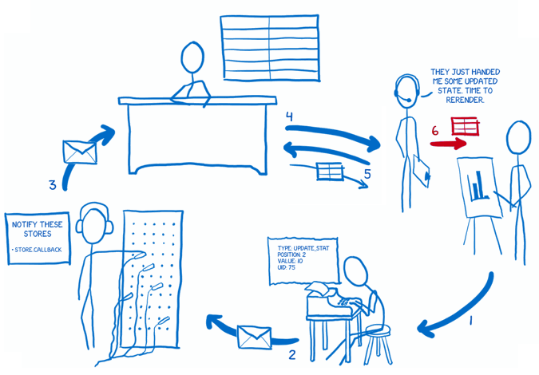

В основе архитектурного шаблона Flux лежит концепция однонаправленного потока данных как способ организации управления
состоянием в веб-приложениях. Именно этот архитектурный шаблон лег в основу популярной библиотеки для управления
состоянием Redux.

Документация по теме:

- 🔗 [A cartoon guide to Flux](https://code-cartoons.com/articles/a-cartoon-guide-to-flux/)
- 🔗 [Flux
  Concepts by Facebook (GitHub)](https://github.com/facebookarchive/flux/tree/main/examples/flux-concepts)
- 🔗 [Разбираемся с Flux, реактивной архитектурой от facebook](https://habr.com/ru/articles/246959/)
- 🔗 [Красная нить MVC-Flux-Redux](https://habr.com/ru/companies/nordclan/articles/692492/)

[⬆ Back to Top](#путеводитель-по-flux-в-картинках)

