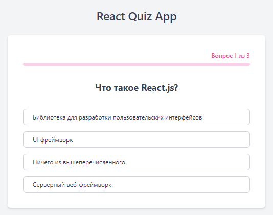
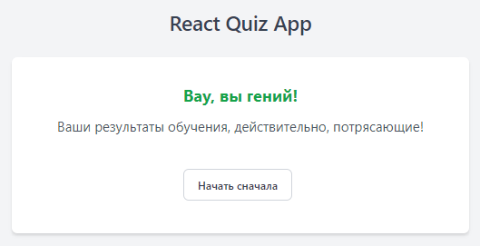
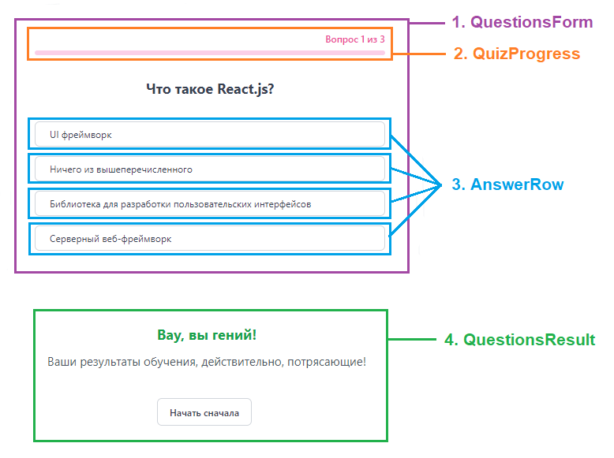

# Руководство React Quiz App - Мыслим как React

📚 Содержание:

- [Начните с макета.](#начните-с-макета)
- [Шаг 1: Разбейте пользовательский интерфейс на иерархию компонентов.](#шаг-1-разбейте-пользовательский-интерфейс-на-иерархию-компонентов)
- [Шаг 2. Создайте статическую версию в React.](#шаг-2-создайте-статическую-версию-в-react)
- [Шаг 3. Найдите минимальное, но полное представление состояния пользовательского интерфейса.](#шаг-3-найдите-минимальное-но-полное-представление-состояния-пользовательского-интерфейса)
- [Шаг 4: Определите, в каком компоненте должно находиться ваше состояние](#шаг-4-определите-в-каком-компоненте-должно-находиться-ваше-состояние)
- [Шаг 5. Добавьте обратный поток данных](#шаг-5-добавьте-обратный-поток-данных)

React может изменить ваше представление о проектах, которые вы рассматриваете, и о приложениях, которые вы создаете.
Когда вы создаете пользовательский интерфейс с помощью React, вы сначала разбиваете его на части, называемые
компонентами. Затем вы описываете различные визуальные состояния для каждого из ваших компонентов. Наконец, вы соедините
свои компоненты вместе, чтобы данные проходили через них. В этом разделе будет описан мыслительный процесс создания
небольшого приложение `React Quiz App`.

### Начните с макета.

Представьте, что у вас уже есть JSON API и макет от дизайнера, JSON API на старте вполне может заменить импорт JSON
данных из статического файла.

JSON API возвращает некоторые данные, которые выглядят следующим образом:

```js
// questions.ts
[
  {
    ask: 'Что такое React.js?',
    answers: [
      {
        text: 'Серверный веб-фреймворк',
        isCorrect: false,
      },
      {
        text: 'UI фреймворк',
        isCorrect: false,
      },
      {
        text: 'Библиотека для разработки пользовательских интерфейсов',
        isCorrect: true,
      },
      {
        text: 'Ничего из вышеперечисленного',
        isCorrect: false,
      },
    ],
  },
  //...
];
```

```js
// results.ts
[
  {
    min: 0,
    max: 2,
    title: 'Попробуйте еще раз!',
    desc: 'Еще немного позаниматься и у вас  все получится!',
  },
  {
    min: 3,
    max: 3,
    title: 'Вау, вы гений!',
    desc: 'Ваши результаты обучения, действительно, потрясающие!',
  },
]
```

Макет приложения может выглядеть следующим образом:





[⬆ Back to Top](#руководство-react-quiz-app---мыслим-как-react)

### Шаг 1:  Разбейте пользовательский интерфейс на иерархию компонентов.

Начните с рисования рамок вокруг каждого компонента и подкомпонента в макете и присвоения им названий.

В зависимости от вашего опыта вы можете разделить проект на компоненты разными способами:

- **Программирование** - используйте те же методы, чтобы решить, следует ли вам создавать новую функцию или объект.
  Одним из
  таких методов является принцип единой ответственности (SOLID), то есть в идеале компонент должен решать только одну
  задачу. Если компонент в конечном итоге растет, его следует разбить на более мелкие подкомпоненты.
- **CSS** - подумайте, для чего вы будете создавать селекторы классов. (Однако компоненты немного менее детализированы.)
- **Дизайн** - подумайте, как бы вы организовали слои дизайна.

Если ваш JSON хорошо структурирован, вы часто обнаружите, что он естественным образом соответствует структуре
компонентов вашего пользовательского интерфейса. Это связано с тем, что модели пользовательского интерфейса и данных
часто имеют одинаковую информационную архитектуру, то есть одну и ту же форму. Разделите свой пользовательский интерфейс
на компоненты, где каждый компонент соответствует одной части вашей модели данных.

На этом экране имеется три компонентов:



1. `<QuestionsForm />` - отображает форму вопроса, которая содержит один вопрос и список ответов на него
2. `<QuizProgress>` - отображает текущий прогресс викторины
3. `<AnswerRow />` - отображает один ответ из списка ответов
4. `<QuestionsResult />` - отображает результат викторины

Если вы посмотрите на `<QuestionsForm />`, вы увидите, что текст вопроса и не является отдельным компонентом. Это вопрос
предпочтений, и вы можете пойти любым путем. В этом примере он является частью `<QuestionsForm />`, поскольку он
отображается
перед списком вопросов и является простым текстом без какой либо функциональности.

Теперь, когда вы определили компоненты макета, расположите их в иерархию. Компоненты, которые появляются внутри другого
компонента в макете, должны отображаться как дочерние компоненты в иерархии:

- `<App />`
  - `<QuestionsForm />`
    - `<QuizProgress>`
    - `<AnswerRow />`
    - `<AnswerRow />`
    - `<AnswerRow />`
  - `<QuestionsResult />`

Список ответов можно было бы выделить в отдельный компонент `<AnswersList/>`, но так как список ответов как отдельный
компонент не имеет дополнительной функциональности и своей логики, то в этом случае он будет избыточным.

[⬆ Back to Top](#руководство-react-quiz-app---мыслим-как-react)

### Шаг 2. Создайте статическую версию в React.

Теперь, когда у вас есть иерархия компонентов, пришло время реализовать ваше приложение. Самый простой подход - создать
версию, которая отображает пользовательский интерфейс на основе вашей модели данных без добавления какой-либо
интерактивности… пока!

> Для создания статической версии нужно много печатать и не думать, а для добавления
> интерактивности нужно много думать, а не печатать.

Чтобы создать статическую версию вашего приложения, отображающую вашу модель данных, вам потребуется создать компоненты,
которые повторно используют другие компоненты и передают данные с помощью пропосов.

Не нужно использовать переменные
состояния для создания этой статической версии. Состояние зарезервировано только для интерактивности, то есть данных,
которые изменяются со временем. Поскольку это статическая версия приложения, тут переменные состояния тут не требуются.

Начнем сроить наше приложение «снизу вверх», начав с создания компонентов ниже в иерархии, данный подход «снизу вверх»,
применяется в крупных проектах и является более оптимальным.

```jsx
const AnswerRow = ({text}) => {
  return <div>{text}</div>;
};

const QuizProgress = ({totalQuestions}) => {
  return (
    <>
      <div>Вопрос 1 из {totalQuestions}</div>
      <div style={{width: `33%`}}>33%</div>
    </>
  );
}

const QuestionsForm = ({questions}) => {
  const {ask, answers} = questions[0];

  // Create answers list
  const answersList = answers.map(({text, isCorrect}) => (
    <AnswerRow text={text} />
  ));

  return (
    <>
      <QuizProgress totalQuestions={questions.length} />
      <h2>{ask}</h2>
      {answersList}
    </>
  );
}

const QuestionsResult = ({results}) => {
  const {title, desc} = results[0];

  return (
    <>
      <h2>{title}</h2>
      <p>{desc}</p>
    </>
  );
}

// Список вопросов викторины
import questions from '@/data/questions.ts';

// Список результатов, возможные варианты результатов на основе количество правильных ответов
import results from '@/data/results.ts';

export const App = () => {
  return (
    <>
      <h1>React Quiz App</h1>
      <div>
        {questionAnswered < questions.length ? (
          <QuestionsForm questions={questions} />
        ) : (
          <QuestionsResult results={results} />
        )}

        {questionAnswered === questions.length && (
          <div>
            <button type="button">Начать сначала</button>
          </div>
        )}
      </div>
    </>
  );
}
```

После создания компонентов у вас будет библиотека повторно используемых компонентов, которые отображают вашу модель
данных. Поскольку это статическое приложение, компоненты будут возвращать только JSX. Отправной точкой на вершине
иерархии будет ваш компонент `<App />`, он будет использовать вашу модель данных в качестве опоры. Это называется
односторонним потоком данных (`one-way data flow` - архитектура `Flux`), поскольку данные текут вниз от компонента
верхнего
уровня к компонентам в нижней части дерева.

[⬆ Back to Top](#руководство-react-quiz-app---мыслим-как-react)

### Шаг 3. Найдите минимальное, но полное представление состояния пользовательского интерфейса.

Чтобы сделать пользовательский интерфейс интерактивным, вам необходимо разрешить пользователям изменять базовую модель
данных. Для этого вы будете использовать состояние.

Подумайте о состоянии как о минимальном наборе изменяющихся данных, которые ваше приложение должно запомнить. Самый
важный принцип структурирования состояния - следовать принципу DRY (Don’t Repeat Yourself). Определите абсолютно
минимальное представление состояния, которое необходимо вашему приложению, и вычислите все остальное по требованию.
Например, если вы создаете список вопросов, вы можете хранить элементы в виде массива по состоянию. Если вы хотите также
отобразить количество элементов в списке, не сохраняйте количество элементов как другое значение состояния - вместо
этого считайте длину вашего массива.

Теперь подумайте обо всех фрагментах данных в этом примере приложения:

1. Список вопросов викторины
2. Список результатов, возможные варианты результатов на основе количество правильных ответов
3. Количество ответов, переменная отражающая текущий прогресс викторины
4. Количество правильных ответов

Какие фрагменты данных из этого является состоянием? Определите те, которые не являются.

- Остается ли фрагмент данных неизменным с течением времени? Если да, то это не состояние.
- Передается ли он от родительского компонента через пропсы? Если да, то это не состояние.
- Можете ли вы вычислить его на основе существующего состояния или пропсов вашего компонента? Если да, то это точно не
  состояние!

То, что осталось, это вероятно можно определить как состояние.

Давайте пройдемся по ним еще раз:

- Исходный список вопросов викторины не меняется со временем и передается в качестве пропсов, поэтому он не является
  состоянием.
- Исходный список результатов не меняется со временем и передается в качестве пропсов, поэтому он не является
  состоянием.
- Количество ответов похоже на состояние, поскольку оно меняется со временем и не может быть вычислено из чего-либо.
- Количество правильных ответов похоже на состояние, поскольку оно меняется со временем и не может быть вычислено из
  чего-либо.

Это означает, что `Количество ответов` и `Количество правильных ответов` являются переменными состояния! Отлично
сделано!

> В React есть два типа «модельных» данных: пропсы и состояние (Props and State).
>
> Они очень разные:
> - Пропсы похожи на аргументы, которые вы передаете функции. Они позволяют родительскому компоненту передавать
    данные дочернему компоненту и настраивать его внешний вид. Например, форма может передать свойство цвета кнопке.
> - Состояние похоже на память компонента. Это позволяет компоненту отслеживать некоторую информацию и изменять ее в
    ответ на взаимодействия. Например, Button может отслеживать состояние isHovered.
>
> Пропсы и состояние разные, но они работают вместе. Родительский компонент часто сохраняет некоторую информацию в
> состоянии (чтобы можно было ее изменить) и передает ее дочерним компонентам в качестве пропсов. Ничего страшного, если
> при первом чтении разница все еще кажется нечеткой. Чтобы это действительно прижилось, нужно немного
> практики!

[⬆ Back to Top](#руководство-react-quiz-app---мыслим-как-react)

### Шаг 4: Определите, в каком компоненте должно находиться ваше состояние

После определения минимальных данных о состоянии вашего приложения вам необходимо определить, какой компонент отвечает
за изменение этого состояния или владеет этим состоянием.

💡 Помните: React использует односторонний поток данных, передавая данные вниз по иерархии компонентов от родительского
компонента к дочернему.

Это может оказаться непростой задачей, если вы новичок в этой концепции, но вы можете во всем разобраться, выполнив
следующие действия!

Для каждой части состояния в вашем приложении:

**Определите каждый компонент, который что-то отображает на основе этого состояния.**

**Найдите их ближайший общий родительский компонент - компонент, расположенный выше всех в иерархии.**

**Решите, где должно находиться состояние:**

1. Часто вы можете поместить состояние непосредственно в их общего родителя.
2. Вы также можете поместить состояние в какой-либо компонент выше их общего родителя.
3. Если вы не можете найти компонент, в котором будет находиться состояние, создайте новый компонент исключительно для
   хранения состояния и добавьте его где-нибудь в иерархии выше общего родительского компонента.

На предидущем шаге вы определили что `Количество ответов` и `Количество правильных ответов` являются переменными
состояния.

Теперь давайте рассмотрим нашу стратегию для них:

- Компонент `<QuestionsForm />` использует переменную состояния `Количество ответов`, он вычисляет какой вопрос нужно
показывать каждый момент времени в соответствии с количеством ответов и он же при взаимодействии с пользователем
изменяет это состояние (когда пользователь дает ответ, `Количество ответов` увеличивается на 1).
 

- Так же компонент `<QuestionsForm />`  использует переменную состояния `Количество правильных ответов`, каждый раз когда
пользователь дает правильный ответ `Количество правильных ответов` на 1.


- Компонент `<QuestionsResult />` использует переменную состояния `Количество правильных ответов`, если пользователь
ответил на все вопросы, то компонент `<QuestionsResult />` получает результат в виде правильных ответов, что бы на
основе него определить и вести результат викторины.


- Компонент `<QuizProgress />` использует переменную состояния `Количество правильных ответов` для отображения прогресса
викторины.

В результате мы имеем `Количество ответов` и `Количество правильных ответов` - две переменные состояния, которые связаны
с двумя компонентами `<QuestionsForm />`, `<QuestionsResult />` и дочерним компонентом `<QuizProgress />`, и эти
переменные могут находиться в общем родительском компоненте верхнего уровня, в нашем случае это `<App> /`.

Теперь можно добавить состояние к компоненту `<App />` с помощью хука `useState()` и передать значения в дочерние
компоненты:

```jsx
const QuizProgress = ({questionAnswered, totalQuestions}) => {
  return (
    <>
      <div>Вопрос {questionAnswered + 1} из {totalQuestions}</div>
      <div style={{width: `33%`}}>33%</div>
    </>
  );
};

const QuestionsForm = ({questions, questionAnswered}) => {
  const {ask, answers} = questions[questionAnswered];

  // Create answers list
  const answersList = answers.map(({text, isCorrect}) => (
    <AnswerRow text={text} />
  ));

  return (
    <>
      <QuizProgress questionAnswered={questionAnswered} totalQuestions={questions.length} />
      <h2>{ask}</h2>
      {answersList}
    </>
  );
};

const QuestionsResult = ({totalCorrect, results}) => {
  let resultIndex = 0;

  results.forEach(({max, min}, index) => {
    if (min <= totalCorrect && max >= totalCorrect) {
      resultIndex = index;
    }
  });

  const {title, desc} = results[resultIndex];

  return (
    <>
      <h2>{title}</h2>
      <p>{desc}</p>
    </>
  );
};

// ...

const QuestionsForm = ({questions, questionAnswered, onAnswerQuestion}) => {
  const {ask, answers} = questions[questionAnswered];
  //...
};

//...

export const App = () => {
  // Количество ответов, переменная отражающая текущий прогресс викторины
  const [questionAnswered, setQuestionAnswered] = useState(0);

  // Количество правильных ответов
  const [totalCorrect, setTotalCorrect] = useState(0);

  return (
    <>
      <h1>React Quiz App</h1>
      <div>
        {questionAnswered < questions.length ? (
          <QuestionsForm questions={questions} questionAnswered={questionAnswered} />
        ) : (
          <QuestionsResult totalCorrect={totalCorrect} results={results} />
        )}

        {questionAnswered === questions.length && (
          <div>
            <button type="button">Начать сначала</button>
          </div>
        )}
      </div>
    </>
  );
};
```

[⬆ Back to Top](#руководство-react-quiz-app---мыслим-как-react)

### Шаг 5. Добавьте обратный поток данных

В настоящее время ваше приложение корректно отображается с пропсами и состоянием, передаваемыми по иерархии. Но чтобы
изменить состояние в соответствии с пользовательским вводом, вам потребуется поддержка передачи данных в другом
направлении: компонент формы `<QuestionsForm />` в иерархии должен обновлять состояние в родительском
компоненте `<App />`.

Для того, что бы можно было обновлять данные родительского компонента из дочерних, нужно передать функции управления
данными в дочерние компоненты, то есть предать необходимые функции которые позволят изменять данные в соответствии
с вводом пользователя.

```jsx
// onAnswerQuestion получен из родитеслького компонента <QuestionsForm />
const AnswerRow = ({text, onAnswerQuestion}) => {
  return (
    <div className={styles.answer} onClick={onAnswerQuestion}>
      {text}
    </div>
  );
};

//...

export const App = () => {
  // Количество ответов, переменная отражающая текущий прогресс викторины
  const [questionAnswered, setQuestionAnswered] = useState(0);

  // Количество правильных ответов
  const [totalCorrect, setTotalCorrect] = useState(0);

  // Функция ответа на вопрос
  const answerQuestion = (isCorrect) => {
    if (isCorrect) {
      setTotalCorrect(totalCorrect + 1);
    }

    setQuestionAnswered(questionAnswered + 1);
  };

  return (
    <>
      <h1>React Quiz App</h1>
      <div>
        {questionAnswered < questions.length ? (
          <QuestionsForm
            questions={questions}
            questionAnswered={questionAnswered}
            onAnswerQuestion={answerQuestion}
          />
        ) : (
          <QuestionsResult totalCorrect={totalCorrect} results={results} />
        )}

        {questionAnswered === questions.length && (
          <div>
            <button type="button">Начать сначала</button>
          </div>
        )}
      </div>
    </>
  );
}
```

Функция `answerQuestion(isCorrect)` принимает ответ на вопрос в виде значения `true` или `false` и меняет переменные
состояния, в момент изменения состояния компонент `<App />` будет вызван повторный рендеринг, если количество ответов
совпадет с количеством вопросов то будет показан компонент с результатами викторины `<QuestionsResult />`, в противном
случае будет показан компонент `<QuestionsForm />` с переданными в него новыми значениями состояния.

Что бы завершить ваше приложение, нужно добавить обработчик событий на кнопку `Начать сначала`:

```jsx
export const App = () => {
  //...

  const resetQuiz = () => {
    setQuestionAnswered(0);
    setTotalCorrect(0);
  };

  //...
  <button type="button" onCLick={resetQuiz}>Начать сначала</button>
}
```

Это было очень краткое введение в то, как следует подходить к созданию компонентов и приложений с помощью React.

🔗 [Ссылка на деплой полной версии приложения](https://quiz-app-ab1e50.netlify.app)

Готовый пример с приложением находится в src раздела chapter-12.

Для запуска примера с готовым приложением выполните команды:
```shell
git clone https://github.com/shopot/react-101.git

git checkout chapter-11

npm install

npm run dev
```

Документация по теме:

- 🔗 [Thinking in React](https://react.dev/learn/thinking-in-react)
- 🔗 [Passing Props to a Component](https://react.dev/learn/passing-props-to-a-component)
- 🔗 [State: A Component's Memory](https://react.dev/learn/state-a-components-memory)
- 🔗 [useState() Hook](https://react.dev/reference/react/useState)
- 🔗 [Adding Interactivity](https://react.dev/learn/adding-interactivity)
- 🔗 [Describing the UI](https://react.dev/learn/describing-the-ui)

[⬆ Back to Top](#руководство-react-quiz-app---мыслим-как-react)
