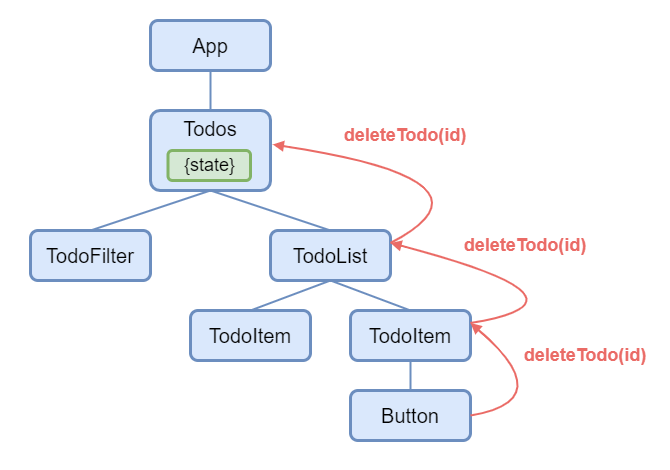
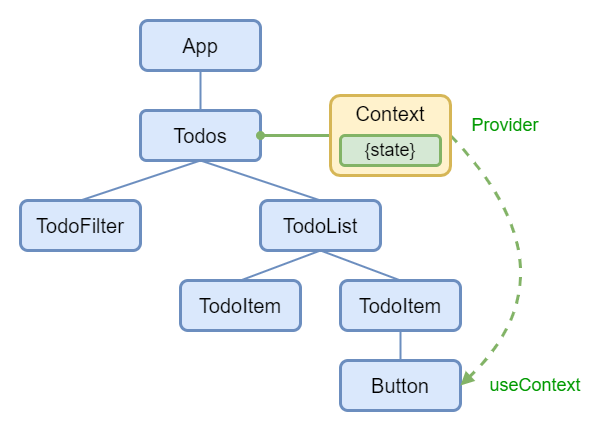

# Знакомство с хуком useContext

📚 Содержание

- [Передача данных в глубь дерева компонентов](#передача-данных-в-глубь-дерева-компонентов)
- [Использование React Context API](#использование-react-context-api)
- [Создание контекста - `createContext()`](#создание-контекста---createcontext)
- [Создание провайдера контекста - `<SomeContext.Provider>`](#создание-провайдера-контекста---somecontextprovider)
- [Чтение и изменение контекста](#чтение-и-изменение-контекста)
- [Переопределение контекста для части дерева компонентов](#переопределение-контекста-для-части-дерева-компонентов)
- [ Масштабирование с помощью React Context API и `useReducer()`](#масштабирование-с-помощью-react-context-api-и-usereducer)

### Передача данных в глубь дерева компонентов

Для передачи данных между компонентами в React используются пропсы, которые передаются от родительского компонента
дочернему - это одна из основных концепций React.

Когда несколько компонентов имеют общее состояние и нужно, что бы это состояние менялось в двух компонентах
одновременно, то в этом случае используется "подъем состояния" (Lifting State Up).

В процессе "подъема состояния" состояние, которое было определено в дочернем компоненте, "поднимается" на уровень выше и
становится свойством родительского компонента. Дочерние компоненты получают это состояние через пропсы и могут обновлять
его с помощью функций обратного вызова (callback functions), переданных родительскому компоненту.

Такой подход делает управление состоянием более предсказуемым и простым, что упрощает отладку и поддержку кода.

Однако, использование пропсов в такой манере может порождать проблему, известную как "prop drilling". Проблема
заключается в том, что если необходимые пропсы хранятся на нескольких уровнях цепочки компонентов, то приходится
передавать пропсы через каждый компонент, который находится между родительским и дочерним компонентом.



"Prop drilling" имеет следующие негативные последствия:

- Сложность чтения и поддержки кода: при передаче пропс через множество уровней вложенности компонентов, код может стать
  сложным для чтения и понимания, что затрудняет его сопровождение и поддержку.
- Проблемы с производительностью: каждый раз при передаче пропсов происходит новый рендеринг компонента, что может
  негативно сказаться на производительности, особенно если уровень вложенности компонентов очень высок.
- Необходимость передачи ненужных данных: часто требуется передавать данные через несколько уровней вложенности, даже
  если они нужны только в одном компоненте, что может привести к передаче ненужных данных.
- Невозможность повторного использования: когда компоненты зависят от конкретных пропсов, их повторное использование в
  другом контексте может быть затруднено без модификации кода компонента.

Помимо стандартного подхода с передачей пропсов от родительского компонента дочернему, React позволяет передавать данные
в приложение и получать эти данные внутри любого компонента напрямую, минуя пропсы, через механизм контекста.

В React контекст (React Context API) - это встроенный в React механизм передачи данных от родительских компонентов к
вложенным компонентам без необходимости передавать пропсы через каждый уровень иерархии компонентов.



`useContext()` - это React Hook, который позволяет вам читать и подписываться на контекст из вашего компонента.

[⬆ Back to Top](#знакомство-с-хуком-usecontext)

### Использование React Context API

Объект контекст (Context) в React создается с помощью функции `createContext()`.
Значение контекста может быть доступно любому компоненту, который является потомком компонента, который был обернут в
провайдер (Context.Provider) контекста.

Чтобы использовать контекст в React, нужно выполнить три основных шага:

1. Создать новый объект контекста с помощью функции `createContext()`.
2. Создать провайдер (Provider) контекста в родительском компоненте, передав ему значение контекста.
3. Обновить значения контекста с помощью функции-сеттера в любом вложенном компоненте, который имеет доступ к контексту.

[⬆ Back to Top](#знакомство-с-хуком-usecontext)

### Создание контекста - `createContext()`

Чтобы создать новый объект контекста, вызовите функцию `createContext()`.

```jsx
import { createContext } from 'react';

const ThemeContext = createContext(defaultValue);
```

`defaultValue` - это необязательный параметр , который устанавливает значение по умолчанию для контекста. Если при
обращении к контексту не найдено значение, то будет использовано значение defaultValue, если оно было определено. Если у
вас нет значения по умолчанию, можно просто указать null.

`createContext()` возвращает объект контекста, который не содержит никакой информации. В объекте контекста есть два
свойства: `Provider` и `Consumer`. `Provider` - это компонент, который устанавливает контекст и передает данные через
иерархию компонентов. `Consumer` - это альтернативный и редко используемый способ чтения значения контекста, вместо него
чаще всего вы будете использовать `useContext()`.

[⬆ Back to Top](#знакомство-с-хуком-usecontext)

### Создание провайдера контекста - `<SomeContext.Provider>`

Оберните свои компоненты в провайдера контекста, чтобы указать значение этого контекста для всех компонентов внутри.

```jsx
const App = () => {
  const [theme, setTheme] = useState('light');
  // ...
  return (
    <ThemeContext.Provider value={theme}>
      <Page />
    </ThemeContext.Provider>
  );
}
```

Параметры:

`value` это значение, которое вы хотите передать всем компонентам, читающим этот контекст внутри
провайдера (`ThemeContext.Provider`), независимо от вложенности компонентов. Значение контекста может быть любого типа.
Компонент, вызывающий `useContext(ThemeContext)` внутри провайдера, получает значение соответствующего провайдера
контекста в который он обернут.

[⬆ Back to Top](#знакомство-с-хуком-usecontext)

### Чтение и изменение контекста

`useContext()` возвращает значение контекста для вызывающего компонента, в качестве параметра этот хук
принимает контекст, который вы ранее создали с помощью `createContext()`.

До появления `useContext()` существовал более старый способ чтения контекста c использованием `Consumer` объекта
контекста. Хотя этот старый способ все еще работает, но весь новый написанный код должен читать контекст с
помощью `useContext()`.

```jsx
const Button = () => {
  // ✅ Recommended way
  const theme = useContext(ThemeContext);

  return <button className={theme} />;
};
```

Если контекст в вашем приложении изменяется, это означает, что изменения данных, передаваемых через контекст, будут
отражаться во всех компонентах, которые используют этот контекст.

Если контекст изменился и React обнаружил эти изменения, то React будет реагировать на эти изменения и автоматически
перерендеривать только те компоненты, которые используют этот контекст.

💡 Для создания контекста, который может изменяться, вы должны использовать метод `useState()` или `useReducer()`. Если
вы передаете неизменяемый объект через контекст, изменение его свойств не приведет к повторному рендеренгу компонентов,
которые используют этот контекст.

```jsx
const App = () => {
  const [theme, setTheme] = useState('dark');
  const [currentUser, setCurrentUser] = useState({name: 'Taylor'});

  // ...

  return (
    <ThemeContext.Provider value={theme}>
      <AuthContext.Provider value={currentUser}>
        <Page />
      </AuthContext.Provider>
    </ThemeContext.Provider>
  );
}
```

В этом примере компонент `<Page />` и все его дочерние компоненты, независимо от глубины, будут «видеть» передаваемые
значения контекста. Если переданные значения контекста изменятся, React также перерисует компоненты, читающие этот
контекст.

#### ⚠️ Предостережения

- На вызов useContext() в компоненте не влияют провайдеры, возвращаемые из того же компонента.
  Соответствующий `<Context.Provider>` должен находиться над компонентом, выполняющим вызов `useContext()`.
- React автоматически перерисовывает все дочерние элементы, которые используют определенный контекст, начиная с
  провайдера, который получает другое значение. Предыдущее и следующее значения сравниваются с помощью сравнения
  `Object.is()`. Пропуск повторных рендерингов с помощью `memo()` не мешает дочерним элементам получать новые значения
  контекста.
- Если ваша система сборки выдает на выходе дубликаты модулей (что может случиться с символическими ссылками), это может
  привести к нарушению контекста. Передача чего-либо через контекст работает только в том случае, если `SomeContext`,
  который вы используете для предоставления контекста, и `SomeContext`, который вы используете для его чтения, являются
  одним и тем же объектом, что определяется сравнением `===`.

💡 `useContext()` всегда ищет ближайшего провайдера над компонентом, который его вызывает. Он выполняет поиск вверх и не
учитывает провайдеров в компоненте, из которого вы вызываете useContext().

[⬆ Back to Top](#знакомство-с-хуком-usecontext)

### Переопределение контекста для части дерева компонентов

Вы можете переопределить контекст для части дерева, обернув эту часть в провайдера с другим значением.

```jsx
<ThemeContext.Provider value="dark">
  ...
  <ThemeContext.Provider value="light">
    <Footer />
  </ThemeContext.Provider>
  ...
</ThemeContext.Provider>;
```

Вы можете вкладывать и переопределять провайдеры столько раз, сколько вам нужно.

[⬆ Back to Top](#знакомство-с-хуком-usecontext)

### Масштабирование с помощью React Context API и `useReducer()`

У нас есть исходное приложение "Todo App" из раздела [chapter-15](https://github.com/shopot/react-101/tree/chapter-15),
где компонент `<App />` определяет состояние с использованием хука useReducer() и затем передает это состояние и методы
для управления этим состоянием в свои дочерние компоненты.

Давайте создадим контекст для состояния и заменим использование пропсов на использование контекста в дочерних
компонентах приложения "Todo App".

Для рефакторинга исходного приложения "Todo App" необходимо выполнить следующие шаги:

1. Создать контекст, который будет содержать значение в виде состояния на основе хука `useReducer()`.
2. Создать HOC компонент обертку `<TodoProvider />` для провайдера контекста и обернуть им дерево компонентов.
3. Создать пользовательский хук для получения значения в виде списка Todo и функции `dispatch` из контекста.
4. Заменить передачу пропсов в дочерних компонентах на чтение и обновление данных из контекста.

Рассмотрим создание контекста с использованием хука `useState()`:

```jsx
import { createContext } from 'react';

const ThemeContext = createContext(null);

// ...
const MyPage = () => {
  const [theme, setTheme] = useState('dark');

  return (
    <ThemeContext.Provider value={theme}>
      <Form />
      <button onClick={() => setTheme('light')}>
        Switch to light theme
      </button>
    </ThemeContext.Provider>
  );
};

// ...
import { useContext } from 'react';

const Form = () => {
  const theme = useContext(ThemeContext);
  // ...
}


```

Этот пример очень простой, в нем компонент `<Form />` получает доступ к состоянию через `useContext()`, но контекст не
содержит функцию-сеттер и поэтому изменить переменную состояния `theme` в дочерних компонентах невозможно.

Для того что бы менять переменную состояния `theme` нужно иметь возможность получать функцию-сеттер из
хука `useContext()`, то есть помимо переменной состояния значение контекста должно содержать и функцию-сеттер:

```jsx
// ...
const MyPage = () => {
  const [theme, setTheme] = useState('dark');

  return (
    <ThemeContext.Provider value={{theme, setTheme}}>
      <Form />
    </ThemeContext.Provider>
  );
};

// ...
import { useContext } from 'react';

const Form = () => {
  const {theme, setTheme} = useContext(ThemeContext);
  // ...

  <button onCLick={() => setTheme('light')}>
    Switch to light theme
  </button>
}
```

Теперь дочерние компоненты могут использовать функцию-сеттер для изменения состояния.

Данная реализация подразумевает что вы можете использовать переменную состояния и функцию-сеттер раздельно:

```jsx
const Form = () => {
  const {theme} = useContext(ThemeContext);
  // ...
};

const Actions = () => {
  const {setTheme} = useContext(ThemeContext);
  // ...
}
```

Оба компонента `<Form />` и `<Actions />` используют один и тот же контекст, это означает что при изменении значения
контекста React запустит повторный рендеринг для обоих компонентов, это связано с тем что React автоматически
перерисовывает все дочерние компоненты, которые используют определенный контекст.

Для маленьких приложений это не является проблемой, но для больших приложений такая реализация может отрицательно
сказаться на производительности.

Один из подходов для решения этой задачи заключается в разделение контекста на два контекста, первый будет для
переменной состояния, а второй будет предоставлять функцию-сеттер.

Создадим два контекста, один будет содержать список Todo, второй будет предоставлять функцию `dispatch` редюсера.

```jsx
// src/contexts/todo-context.jsx

const TodoContext = createContext(null);

const TodoDispatchContext = createContext(null);
```

Следующим шагом будет создание компонента обертки (Higher-Order Component, HOC) `<TodoProvider />`:

```jsx
// src/contexts/todo-context.jsx

// ...
export const TodoProvider = ({children}) => {
  const [todos, dispatch] = useReducer(todoReducer, []);

  return (
    <TodoContext.Provider value={todos}>
      <TodoDispatchContext.Provider value={dispatch}>
        {children}
      </TodoDispatchContext.Provider>
    </TodoContext.Provider>
  );
};
```

```jsx
// src/app/app.jsx
const App = () => {
  return (
    <TodoProvider>
      <AddTodoForm />
      <TodoList />
    </TodoProvider>
  );
};
```

Задача `<TodoProvider />` принять оборачиваемый компонент, создать состояние с использованием `useReducer()` и через
провайдеры обеспечить доступ к контексту для всех дочерних компонентов.

Все компоненты переданные как `{children}` будет иметь доступ к значениям контекстов `TodoContext`
и `TodoDispatchContext`.

Для удобства использования, что бы не импортировать связку контекст + хук `useContext()`, можно создать пользовательский
хук который упростит эту задачу:

```jsx
// src/contexts/todo-context.jsx

// ...
export const useTodo = () => useContext(TodoContext);

export const useTodoDispatch = () => useContext(TodoDispatchContext);
```

Теперь в дочерних компонентах вместо связки контекст + `useContext()` можно использовать только вызов хука:

`todo-list.jsx`

```jsx
// src/components/todo-list/todo-list.jsx
import { TodoItem } from '../todo-item';
import { useTodo } from '@/contexts';

export const TodoList = () => {
  // Используем хук для получения todos из контекста
  const todos = useTodo();

  const todoList = todos.map((todo) => <TodoItem key={todo.id} todo={todo} />);

  return <div>{todoList}</div>;
};
```

`add-todo-form.jsx`

```jsx
// src/components/add-todo-form/add-todo-form.jsx
import { useState } from 'react';
import { v4 as uuidv4 } from 'uuid';

import { addNewTodo } from '@/reducers/todo';
import { useTodoDispatch } from '@/contexts';

export const AddTodoForm = () => {
  const [title, setTitle] = useState('');

  // Используем хук для получения dispatch из контекста
  const dispatch = useTodoDispatch();

  const handleClick = () => {
    const id = uuidv4();

    dispatch(addNewTodo(id, title))
  };

  return (
    <form>
      <div>
        <input
          value={title}
          onChange={(e) => setTitle(e.target.value)}
        />
        <button type="button" onCLick={handleClick}>
          Add new
        </button>
      </div>
    </form>
  );
};
```

Полный пример приложения на TypeScript находится в `src`.

[⬆ Back to Top](#знакомство-с-хуком-usecontext)

### Итог

- `createContext()` - это функция создает новый контекст, который может быть использован для передачи данных от одного
  компонента к другому через дерево компонентов без необходимости явной передачи свойств через их пропсы.
- `useContext()` - это хук, который позволяет использовать данные, переданные через контекст, внутри функционального
  компонента.
- С помощью `createContext()` можно передать функцию-reducer и начальное значение, чтобы управлять состоянием в
  контексте.
- Использование `useContext()` позволяет избегать передачи данных через пропсы каждому дочернему компоненту.
- При использовании `createContext()` и `useContext()` важно помнить, что контекст может уменьшить читаемость кода и
  усложнить процесс отладки.
- Контекст также может быть использован для упрощения передачи callback-функций между компонентами.
- Создание и использование контекста может помочь улучшить производительность приложения, уменьшив количество повторных
  рендерингов компонентов.
- Использование `createContext()` и` useContext()` может быть особенно полезно для создания темизированных интерфейсов,
  примером может служить библиотека styled-components.

[⬆ Back to Top](#знакомство-с-хуком-usecontext)

🔗 [Ссылка на деплой приложения](https://todo-app-ab1e50.netlify.app)

Готовый пример с приложением находится в `src` раздела chapter-17.

Для запуска примера с готовым приложением выполните команды:

```shell
git clone https://github.com/shopot/react-101.git

git checkout chapter-17

npm install

npm run dev
```

Документация по теме:

- 🔗 [React Hook useContext()](https://react.dev/reference/react/useContext)
- 🔗 [React API: createContext()](https://react.dev/reference/react/createContext)
- 🔗 [Алгоритм сравнения Object.is()](https://developer.mozilla.org/en-US/docs/Web/JavaScript/Reference/Global_Objects/Object/is)


[⬆ Back to Top](#знакомство-с-хуком-usecontext)
